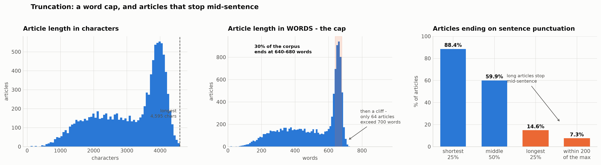
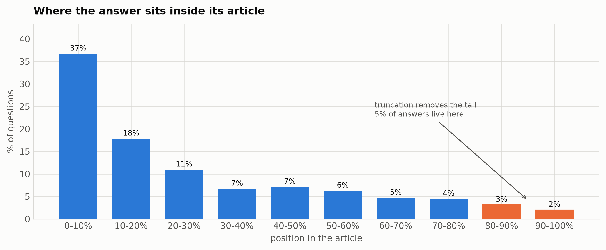
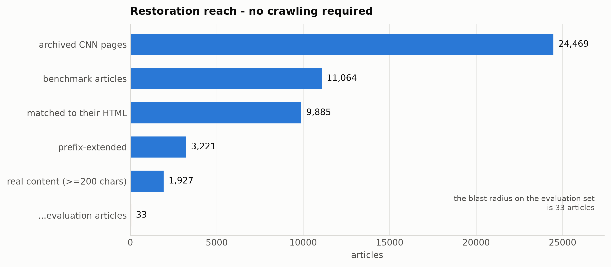
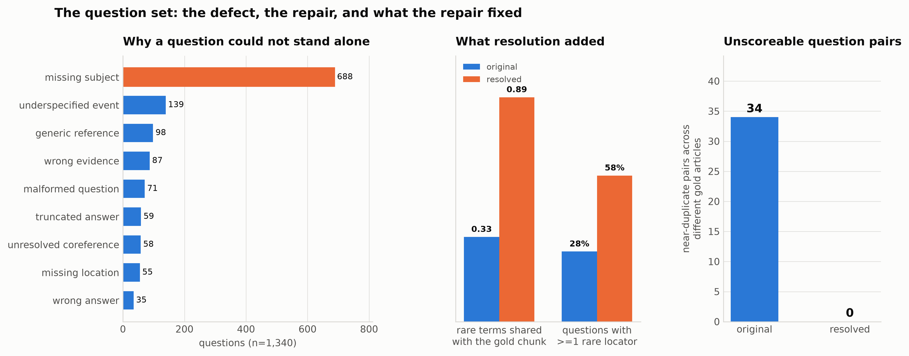
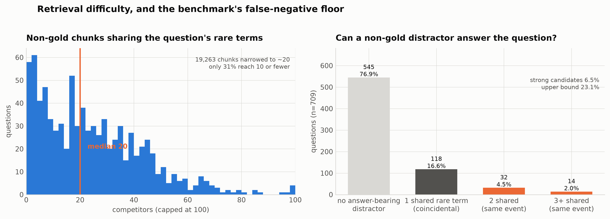

# NewsQA 200/11064 — exploratory data analysis

Scope: the evaluation dataset the retrieval experiments are scored on
(`data/evaluation/newsqa_200_11064/`). The question this report answers is not
"what does the data look like" but **"which properties of this dataset decide
what our experiment results are allowed to claim"**.

Every number here is produced by a script in `scripts/eda/`, and every script
writes its result to `scripts/eda/out/*.json`. `notebooks/06_dataset_eda.ipynb`
runs them in order. Reproduce with:

```bash
python scripts/eda/01_profile.py        # inventory, profile, cleanliness, integrity
python scripts/eda/05_reason_codes.py   # what was wrong with the questions
python scripts/eda/06_near_duplicates.py
python scripts/eda/07_figures.py        # renders every figure below into docs/figures/eda/
```

Figures (300 DPI, `docs/figures/eda/`): `fig1_truncation`, `fig2_evidence_position`,
`fig3_question_repair`, `fig4_retrieval_difficulty`, `fig5_restoration`.

---

## 1. What the dataset is, and where it came from

| | |
|---|---|
| Source | `lucadiliello/newsqa` on Hugging Face, revision `728e5292…` (MRQA format) |
| Evaluation articles | 200 |
| Distractor articles | 10,864 |
| Corpus total | 11,064 articles → **19,263 chunks** @ 512 tokens / 64 overlap |
| Questions | 1,340 selected → 1,336 after review (4 excluded) |
| Partition | 50 development articles, seed 42, article-level split |

Provenance was verified rather than assumed. `01l_verify_source.py` re-downloads
the Hugging Face dataset and matches staged articles by
`article_id = "newsqa_" + sha256(context)[:16]`. Six sampled articles came back
**byte-identical**, and the maximum article length agrees exactly (4,595 chars
in both). The staging pipeline did not alter the source text.

**Why this matters:** anything wrong with the article text is inherited from the
benchmark, not introduced by us. That is the first thing to be able to say when
the dataset choice is challenged.

### Article and question shape

| | evaluation | distractor |
|---|---|---|
| median chars | 3,118 | 3,448 |
| median tokens | 658 | 722 |
| max chars | 4,549 | 4,595 |

Chunking yields **1.74 chunks per article** (1 chunk: 2,971 articles; 2 chunks:
7,987; 3 chunks: 106). Almost every article is one or two chunks, so
*article-level* and *chunk-level* retrieval are nearly the same task on this
corpus. A chunking-strategy experiment therefore has very little room to move
the numbers — worth saying out loud before spending a tournament round on it.

Question length is the clearest single difference between the variants:

| variant | median words | n |
|---|---|---|
| original | 6 | 1,340 |
| reviewed_original | 6 | 1,336 |
| **resolved** | **11** | 1,336 |
| clarified | 12 | 1,078 |

---

## 2. Is the data clean?

Mechanically, yes. Semantically, no.

**Clean:** no HTML tags or entities, no control characters, no tabs, no leading
or trailing whitespace, no empty articles. Evidence spans resolve correctly for
all 1,340 questions (0 mismatched, 0 absent). No orphaned gold chunk IDs. No
resolved question without a gold chunk.

**Not clean — surviving page furniture** (`01f_html_residue.py`, over all 11,064
articles):

| residue | articles |
|---|---|
| block-boundary newline runs (4+) | 9,990 (90%) |
| `(CNN) --` dateline | 10,216 |
| video/gallery teaser ending in `»` | 2,826 |
| "E-mail to a friend" widget | 580 |
| copyright / publisher footer | 166 |

These strings are chunked, embedded and retrieved exactly like article prose.
Section 8 covers what was removed and what was deliberately left alone.

**Not clean — 225 redundant articles.** 224 groups of articles are identical
after whitespace normalisation and differ *only* by whitespace
(`01c_clarified_and_dupes.py`). They cost 386 duplicate chunks (2.0% of the
index) and affect **0 gold chunks**, so they inflate the candidate pool without
changing any answer.

---

## 3. The articles are truncated

This is the largest single finding and the one most likely to be challenged, so
the evidence is laid out in the order it was established.



**What was rejected first.** The initial argument — "the maximum sits just under
4,600 characters, therefore truncation" — is not valid *as stated*. In
characters there is no pile-up at the ceiling: each length near the 4,595
maximum occurs exactly once (left panel).

**What actually holds.** Four independent lines of evidence:

1. **A word cap** (middle panel). The character view hides the cap, because
   articles differ in average word length. Measured in **words** the ceiling is
   unmistakable: **30% of the corpus (3,323 articles) ends between 640 and 680
   words**, then the distribution falls off a cliff — 579 articles reach 680
   words or more, and only **64 exceed 700**. A natural length distribution does not
   spike at one width and stop. This is the strongest single piece of evidence
   and it corrects the earlier "no pile-up" claim: there is one, it is just not
   visible on the character axis.

2. **Sentence-ending gradient** (`01d_truncation.py`, right panel). The share of articles
   ending on sentence punctuation falls with length: **88.4%** for the shortest
   quartile, 59.9% in the middle, **14.7%** for the longest quartile, 7.3%
   within 200 chars of the maximum. Short articles end in a full stop; long ones
   end mid-sentence. Length-dependent mid-sentence endings are truncation.

3. **Exact-prefix pairs** (`01e_truncation_proof.py`). Of 94 benchmark articles
   paired with their archived HTML source, 67 are shorter than the archived
   page, and **50 are an exact character-for-character prefix** of it (at zero
   tolerance). A prefix relationship is truncation by definition.

4. **Live and archived confirmation** (`01k_live_verify.py`). Fetching the
   original CNN URLs reproduces the same result against a third source.

**Scope.** 4,548 of 11,064 articles (41%) end on a lowercase word or comma.
That figure is an upper bound, not a truncation rate — it also catches
unpunctuated bylines and widget endings. Measured against the 94 verified pairs
the regex proxy runs at 67.5% precision and 65.9% recall, and the ≥3,800-char
length threshold at **77.4% precision / 60.0% recall**
(`01n_threshold_validity.py`). **40% of genuinely truncated articles are shorter
than 3,800 characters**, so a length cut-off cannot be used to declare the rest
intact.



**Impact on scoring is small** (`01m_truncation_impact.py`). Evidence sits at
the **18th percentile** of article length on median — NewsQA answers cluster
near the top of the article, exactly where truncation does not reach. Only 34
questions have evidence in the final 10% of their article, and only 9 of those
fall in the at-risk group. 52 evaluation articles carry any risk at all,
covering 321 questions.

**Conclusion.** The corpus is systematically truncated, the truncation is
inherited from the published benchmark, and it damages retrieval far less than
the 41% headline suggests, because NewsQA evidence is front-loaded.

---

## 4. Restoration is possible without re-crawling

`data/cnn_downloads/cnn/downloads/` holds **24,469 archived CNN HTML files** —
the pages the benchmark was built from. `01p_full_coverage.py` parsed all of
them in 1.1 minutes and matched them to the corpus by normalised 200-char
prefix:

| | |
|---|---|
| benchmark articles matched to their HTML | **9,885 / 11,064 (89.3%)** |
| HTML is a strict prefix-extension | 3,221 |
| trivial gains (≤40 chars, page furniture) | 679 |
| **real content recoverable (≥200 chars)** | **1,927** |
| …of which distractors | 1,894 |
| …of which evaluation articles | **33** (≈195 questions) |



Because the benchmark text is an exact **prefix** of the archived text, restored
articles can be built by appending, and existing evidence-span offsets stay
valid unchanged. No crawling is required and no ground truth has to be
re-annotated.

This is the answer to "did you resolve the defect or try to re-crawl": the
material to restore it is already in the repository, the cost is one minute of
CPU, and the blast radius on the evaluation set is 33 articles.

**Recommended shape** (not yet built): restore the 1,894 distractors — this only
makes retrieval harder and cannot inflate a score — and treat the 33 evaluation
articles as a separate, flagged comparison, because lengthening a gold article
can introduce answer text that the closed-world ground truth does not label.

---

## 5. What was wrong with the questions

The review recorded a reason code per question (`05_reason_codes.py`, n=1,340):

| reason code | count | share |
|---|---|---|
| missing_subject | 688 | 51.3% |
| underspecified_event | 139 | 10.4% |
| generic_reference | 98 | 7.3% |
| wrong_evidence | 87 | 6.5% |
| malformed_question | 71 | 5.3% |
| truncated_answer | 59 | 4.4% |
| unresolved_coreference | 58 | 4.3% |
| missing_location | 55 | 4.1% |
| wrong_answer | 35 | 2.6% |
| multiple_corpus_matches | 27 | 2.0% |
| missing_time | 19 | 1.4% |
| others (4 codes) | 13 | 1.0% |



957 questions carry exactly one code, 174 carry two or more, 209 carry none.

**Every code names a checkable property of the question text** — a missing
subject, an unresolved pronoun, a dangling reference — not a judgement about
difficulty. That is what makes resolution auditable rather than a matter of
taste.

### How can an answer be "wrong"? (`wrong_answer`, 35 questions)

This code is the one that most looks like reviewer opinion, so it is worth
spelling out what the 35 cases actually are. All 35 retain
`source_ground_truth`, the original evidence span, and a written rationale, so
each can be re-checked against the article in under a minute.

Of the 31 whose answer text changed:

| change | count | what it means |
|---|---|---|
| replaced by disjoint text | 22 | a genuine correction |
| trimmed (new answer inside the old) | 7 | span-boundary tightening |
| expanded (old answer inside the new) | 2 | span-boundary tightening |

The 22 replacements fall into three checkable kinds, none of which needs a
judgement call:

- **The span is not an answer at all.** *"How many driverless pods were being
  tested?"* → NewsQA answer `'are'`. A crowdsourced span landed on a verb.
- **The answer type contradicts the question word.** *"When were the first
  impeachment charges brought?"* → `'vote-tampering.'` (a charge, not a date).
  *"What country were the passengers from?"* → `'Chinese nationals.'` (a
  nationality, not a country).
- **The stated fact is the wrong one.** *"How many Canadian troops?"* →
  `'35,000.'`, which is the NATO-allies total; the article gives *"more than
  2,800 Canadian troops"*.

**The caveat to state.** 20 of the 31 revised answers are verbatim text from
their own article; **11 are not** — they are normalisations like `'China'` for
`'Chinese nationals'`. For extractive scoring that matters: an answer that is no
longer a literal span cannot be located by span extraction. Those 11 should be
checked before any span-level metric is reported. The 7 trims and 2 expansions
are not error corrections at all and are better described as boundary
adjustments; counting them under `wrong_answer` slightly overstates the code.

Review process: the model proposed 979 `non_standalone`, the human decided 1,078
`human_non_standalone`, **262 proposals (19.6%) were overturned or amended**,
298 answers (22.2%) were modified, and 4 questions were excluded outright. The
human did not rubber-stamp the model.

### Did the repairs actually add retrieval signal?

**What "rare term" means here.** A word's inverse document frequency over the
19,263 chunks: `IDF = log(19,263 / (1 + chunks containing it))`. The threshold
used throughout this report is **IDF ≥ 6.0 — a word appearing in at most ~46 of
19,263 chunks (0.24%)**.

| word | chunks containing it | IDF | rare? |
|---|---|---|---|
| `the` | 19,207 | 0.00 | no |
| `said` | 14,592 | 0.28 | no |
| `police` | 2,871 | 1.90 | no |
| `hurricane` | 230 | 4.42 | no |
| `gabon` | 13 | 7.23 | **yes** |
| `wozniak` | 8 | 7.67 | **yes** |
| `cocodrie` | 1 | 9.17 | **yes** |

In practice a rare term is a **named locator** — a person, place, organisation
or technical term that occurs in a handful of articles. It is the thing that
lets a lexical retriever jump straight to the right chunk instead of ranking by
topic. Examples from the resolved set, rare terms in bold:

> Which crimes was **Theoneste Bagosora** convicted of by the Rwanda tribunal?
> In how many states were cases of the **Listeria monocytogenes** outbreak reported?
> How many militants attacked military **checkposts** in the **Mohmand** agency?

The threshold is a parameter, not a law: 6.0 was chosen so "rare" means roughly
*"in under a quarter of one percent of the corpus"*. Every measurement below
uses the same value, so comparisons between variants are internally consistent
even if the absolute cut-off is arbitrary.

Rare terms added to the question, by defect class:

| reason code | n | +words | +rare terms | ≥1 rare added |
|---|---|---|---|---|
| underspecified_event | 139 | 5.67 | 0.99 | 64.0% |
| generic_reference | 98 | 6.11 | 0.97 | 60.2% |
| unresolved_coreference | 57 | 4.51 | 0.91 | 63.2% |
| wrong_evidence | 86 | 3.71 | 0.77 | 50.0% |
| missing_subject | 688 | 4.33 | 0.73 | 47.4% |
| missing_time | 19 | 3.68 | 0.32 | 31.6% |
| (no code) | 209 | 0.00 | 0.00 | 0.0% |

The repairs that name a *thing* (event, reference, coreference) add the most
lexical signal. Questions with no defect code were left untouched — 0 words
added — which is the control that shows resolution was not a blanket rewrite.

---

## 6. Original vs resolved — the decision and its cost

**The finding that decides it** (`06_near_duplicates.py`):

| | original | resolved |
|---|---|---|
| exact-duplicate question groups | 6 | 47 |
| …spanning **different** articles | **5** | **0** |
| near-duplicate pairs (Jaccard ≥ 0.70) | 94 | 150 |
| …with different gold **and** different article | **34** | **0** |
| questions touched by such a conflict | **49 (3.7%)** | **6 (0.4%)** |

In the original set, 34 pairs of near-identical questions point at different
articles — *"what does faa say"* appears three times with three different gold
articles. **No retriever can separate these.** They are not hard questions; they
are unscoreable ones, and every retriever loses the same points on them.
Resolution eliminates that class entirely.

**Lexical signal** (`03_lexical_overlap.py`):

| | original | resolved |
|---|---|---|
| question words present in gold chunk | 66.1% | 78.4% |
| …against a random chunk (baseline) | 7.5% | 5.8% |
| rare terms shared with gold chunk | 0.33 | **0.89** |
| …against a random chunk | 0.000 | 0.001 |
| questions with ≥1 rare locator | 27.7% | **57.7%** |

Resolution more than doubles the rare-term anchor rate. This is real signal
against a near-zero random baseline — but it is also the honest caveat: **a
lexical retriever benefits from resolution more than a dense one does**, so a
sparse-vs-dense comparison run only on `resolved` is biased toward sparse. That
is why both variants must be run and reported as a range.

**The cost resolution introduces.** 47 groups of originally-distinct questions
collapsed to word-for-word identical text after clarification — 96 questions
(7.2%), leaving **49 redundant queries**:

> *"Where did the nightmare day take place?"* and *"Where did the shooting take
> place?"* both became *"Where did the mass shooting involving Spc. Logan
> Burnette take place?"*

All 47 groups stay within one article and share their gold chunk, so nothing
becomes unscoreable — but 49 questions are now scored twice on the same query,
over-weighting those 47 articles. **Effective distinct queries: 1,287, not
1,336.** Worth a footnote in any reported score.

**Verdict.** `resolved` is the deployment-realistic set: a real user asks *"who
won the Gabon election"*, not *"who won it"*. `original` is the floor. Report
both as a floor–ceiling range and name which is which; do not publish either
alone.

---

## 7. How hard is retrieval here, and is the ground truth closed?

`04_distractor_collision.py`, on the resolved set.



**Competition.** Rare terms cut the candidate pool from 19,263 chunks to a
median of **20** non-gold competitors (p90 = 49, max = 171). Only **30.7%** of
questions are narrowed to 10 or fewer, and **493 questions (37%) contain no rare
term at all**, leaving lexical retrieval no sharp handle.

> First-stage retrieval closes 19,263 → ~20 but cannot finish. That is the
> measured, dataset-level justification for the cross-encoder reranker,
> independent of any tournament result.

**Unlabelled answers.** 23.1% of checked questions have a *distractor* chunk
containing the gold answer string. That is an upper bound: string presence is
not answering. Grading each match by how many of the question's rare terms the
answer-bearing distractor also carries:

| match strength | share |
|---|---|
| no answer-bearing distractor | 76.9% |
| 1 shared rare term — likely coincidental | 16.6% |
| 2 shared — probably the same event | 4.5% |
| 3+ shared — almost certainly the same event | 2.0% |

**≈6.5% of questions have a distractor that plausibly answers them** — the same
news event covered in a second article. Example: *"What made landfall near
Cocodrie, Louisiana?"* → *Hurricane Gustav*, present in a second Gustav article
that is not labelled gold.

**Consequence.** The benchmark's closed-world assumption — exactly one chunk is
correct — is already violated at **6.5% (strong) to 23.1% (upper bound)**. Every
reported retrieval score carries a false-negative floor of that size. This is
also far more than the review's own 27 `multiple_corpus_matches` flags, which
were found by spot-check rather than systematically.

*Caveat: this is a proxy — shared rare terms plus answer-string presence, not
verified reading. A human check of a sample of the 46 strong cases would be
needed for a true rate.*

---

## 8. Cleaning applied

`scripts/clean_corpus.py` (run with `--apply`) writes a parallel
`data/evaluation/newsqa_200_11064/cleaned/` tree. **The locked benchmark under
`final/` is untouched.**

| rule | articles |
|---|---|
| video / gallery teaser line (`Watch … »`) | 2,186 |
| "E-mail to a friend" widget and trailing chrome | 579 |
| copyright / publisher footer | 141 |
| subscribe footer | 1 |
| newline runs of 3+ collapsed to one blank line | all |

2,757 articles changed (24.9%), 167,061 characters removed.

**Evidence spans survive.** Cleaning shifts character offsets, so every deletion
is recorded in an offset map, each span is remapped arithmetically and then
re-verified against the cleaned text: **1,338 spans exact, 3 relocated by
search, 0 broken** on the resolved set. The script refuses to drop a span
silently — a span that cannot be resolved is flagged
`evidence_spans_broken`. `python scripts/clean_corpus.py --selfcheck` runs the
offset-map check.

**Deliberately NOT removed.** The residue scan flagged an "All About"
related-topics pattern (145 articles) and a bullet separator (123). Reading the
matches showed most are prose — *"it's all about the arms"*, *"what life is all
about"* — or genuine list markers. Removing them would delete article content,
which is a worse error than leaving furniture behind. The `(CNN) --` dateline is
also kept: it is part of the published article text, appears in 92% of articles,
and carries no discriminative signal either way.

The 225 whitespace-duplicate articles are **not** deduplicated, because that
would change chunk IDs and invalidate the locked Phase-2 artifacts for a 2.0%
index reduction that touches no gold chunk. Note it; do not act on it mid-study.

---

## 9. What this means for the experiment configuration

1. **Run both question variants and report a range.** Resolution changes the
   lexical signal enough (0.33 → 0.89 rare anchors) that a single number is not
   defensible, and it favours sparse retrieval specifically.
2. **The reranker is justified by the data, not only by the tournament.** Median
   20 competitors after rare-term filtering; only 31% of questions narrow to 10.
3. **Chunking experiments have little headroom.** 1.74 chunks per article means
   chunk retrieval ≈ article retrieval on this corpus.
4. **@7 is not available.** `score_benchmark_predictions.py` emits k ∈ {1, 3, 5,
   10} filtered by `top_n`. Report @3/@5/@10, or change the scorer — do not
   report a @7 that was never computed.
5. **State the false-negative floor.** Any reported Hit@K carries a 6.5–23%
   unlabelled-answer error. Scores near the top of the range are inside that
   noise band.
6. **Footnote the 49 duplicate resolved queries** (1,287 effective distinct
   questions).
7. **The judge must differ from the generator.** The benchmark notebook
   previously set `JUDGE_MODEL = GENERATOR_MODEL` with `ALLOW_SAME_JUDGE = True`,
   contradicting its own instructions; that is now fixed and guarded.

---

## 10. Open items

- **Spare benchmark on restored text** — scoped in section 4, not built. Restore
  the 1,894 distractors, re-chunk, re-map gold chunk IDs, audit the 33
  evaluation articles for unlabelled answers, then run the locked config on both
  corpora and report the pair.
- **Human validation** of a sample of the 46 strong unlabelled-answer cases, to
  turn the 6.5% proxy into a measured rate.
- **Phase 1 result CSVs** (`round1/2/3.csv`) are missing from the repository, so
  the documented MiniLM reranker choice cannot be checked against
  `select_winner`'s actual output.
