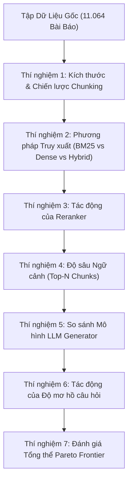

# Kế hoạch Thực nghiệm & Đánh giá RAG (Master Test Plan)

Tài liệu này là bản kế hoạch tổng thể cho toàn bộ các thực nghiệm đánh giá, nghiên cứu bóc tách (ablation study), và định hướng mở rộng kiến trúc sinh nâng cao (Novel/SOTA Generation Frameworks) cho hệ thống **NewsQA RAG**.

---

## 1. Cấu hình Baseline (Chuẩn cơ sở)

Cấu hình Baseline là hệ thống RAG cơ bản hiện tại, hoạt động ổn định và làm mốc so sánh cho tất cả các cải tiến.

| Thành phần | Cấu hình Baseline |
| :--- | :--- |
| **Kho ngữ liệu** | 11.064 bài báo CNN (200 bài validation chứa câu hỏi + 10.864 bài train distractor) |
| **Chunking** | Recursive chunking (`chunk_size: 512`, `chunk_overlap: 64`) |
| **Embedding Model** | `all-MiniLM-L6-v2` (384 chiều, khoảng cách cosine) |
| **Vector DB** | ChromaDB (HNSW index: $M=16, ef=50$) |
| **Sparse Search** | Okapi BM25 |
| **Retrieval Stage** | Hybrid Search (Dense 70% + BM25 30%, lấy top $K=10$) |
| **Reranker** | Cross-Encoder (`ms-marco-MiniLM-L-6-v2`, lọc ra top $N=5$) |
| **LLM Generator** | `gemini-2.0-flash` (hoặc `gpt-4o-mini`, nhiệt độ $0.0$, max tokens $1024$) |
| **Tập đánh giá** | `newsqa_200_11064` (1.152 câu hỏi đã khử trùng lặp ngữ nghĩa) |

---

## 2. Hệ thống Đánh giá & Chấm điểm (Evaluators & Judges)

Hệ thống đánh giá được chia làm 2 tầng: **Deterministic (Định lượng bằng mã, chi phí 0đ)** và **LLM-as-a-Judge (Chấm ngữ nghĩa bằng RAGAS)**.

```text
┌────────────────────────────────────────────────────────────────────────┐
│                        HỆ THỐNG METRIC ĐÁNH GIÁ                        │
├──────────────────────────────────┬─────────────────────────────────────┤
│   Metric Deterministic (0đ)      │        LLM Judge (RAGAS)            │
│  • Hit Rate@K, Recall@K          │  • Faithfulness (Độ trung thực/án ngữ)│
│  • MRR@K, NDCG@K                 │  • Answer Relevancy (Độ liên quan)  │
│  • Exact Match (EM), Token F1    │  • Context Precision (Độ chuẩn ngữ cảnh)│
│  • Citation Precision, Recall, F1│  • Context Recall (Độ phủ ngữ cảnh) │
│  • Độ trễ P95 & Chi phí API      │  • Answer Correctness (Độ chính xác)│
└──────────────────────────────────┴─────────────────────────────────────┘
```

### 2.1. Metric Định lượng (Deterministic - Chạy hoàn toàn offline)
1. **Truy xuất (Retrieval Metrics)** (Đo tại mức ban đầu $K$ và sau rerank $N$):
   - **Hit Rate@K**: Tỷ lệ câu hỏi tìm được ít nhất 1 chunk đúng trong top-$K$.
   - **Recall@K**: Tỷ lệ số chunk đúng tìm được trên tổng số chunk ground truth.
   - **MRR@K (Mean Reciprocal Rank)**: Thứ hạng nghịch đảo của chunk đúng đầu tiên (thưởng rất lớn nếu chunk đúng đứng ở vị trí 1).
   - **NDCG@K**: Đánh giá vị trí xuất hiện của tất cả các chunk đúng.
2. **Chất lượng câu trả lời**:
   - **Exact Match (EM)**: Tỷ lệ câu trả lời khớp chính xác tuyệt đối với đáp án chuẩn.
   - **Token F1**: Điểm F1 trùng khớp từ vựng giữa câu trả lời sinh ra và ground truth.
3. **Trích dẫn nguồn (Citation Metrics)**:
   - **Citation Validity**: Tỷ lệ trích dẫn `[1]`, `[2]` tham chiếu đúng chunk có thực.
   - **Citation Precision & Recall**: Đo xem chunk được trích dẫn có đúng là chunk chứa evidence hay không.
4. **Hiệu năng hệ thống**:
   - **Độ trễ (P50, P90, P95 tính bằng ms)**: Thời gian truy xuất, rerank, và sinh câu trả lời.
   - **Ước tính chi phí**: Số lượng token tiêu thụ và chi phí USD/1.000 lượt hỏi.

### 2.2. Metric Chấm bằng LLM (RAGAS Judge)
Sử dụng script [`scripts/judge_benchmark_predictions.py`](file:///Users/thomas200905/Documents/Thomas/HCMUS/Third%20Year/Semester%209/Text%20Mining/project/Text-Mining---NewsQA-RAG/scripts/judge_benchmark_predictions.py):
- **Faithfulness**: Đo mức độ trung thực của câu trả lời (phát hiện ảo giác - hallucination).
- **Answer Relevancy**: Đánh giá câu trả lời có đi đúng trọng tâm câu hỏi hay không.
- **Context Precision**: Đo xem các chunk xếp hạng đầu có thực sự chứa thông tin cần thiết không.
- **Context Recall**: Đo xem ngữ cảnh truy xuất có đủ thông tin để trả lời toàn diện câu hỏi không.

> [!TIP]
> **Quy tắc Judge độc lập**: LLM đóng vai trò Judge phải mạnh hơn hoặc khác với LLM Generator (Ví dụ dùng `gemini-1.5-pro` làm Judge để chấm điểm cho `gemini-2.0-flash` hoặc `gpt-4o-mini`).

---

## 3. Chiến lược Đánh giá 2 Giai đoạn & Tối ưu Chi phí API

### 3.1. Quy trình Thực nghiệm 2 Giai đoạn (Two-Phase Protocol)
Để đảm bảo tính khoa học cao nhất và tiết kiệm tài nguyên:

```text
┌────────────────────────────────────────────────────────────┐
│ Giai đoạn 1: Sàng lọc & Tối ưu Truy xuất (Retrieval Phase) │
│ • Chạy offline 100% (Chi phí 0đ) trên 1.152 câu hỏi        │
│ • Thử nghiệm toàn bộ tổ hợp Chunking, Retrieval, Reranking │
│ • Tìm ra "Golden Retriever" (Cấu hình có MRR@5 cao nhất)   │
└─────────────────────────────┬──────────────────────────────┘
                              │
                              ▼ (Cố định Golden Retriever)
┌────────────────────────────────────────────────────────────┐
│ Giai đoạn 2: Đánh giá End-to-End & Thử nghiệm Sinh nâng cao│
│ • Cố định Golden Retriever từ Giai đoạn 1                  │
│ • So sánh Baseline Prompting vs Novel Frameworks (Self-RAG)│
│ • Đánh giá RAGAS Judge & Biểu đồ Pareto Frontier           │
└────────────────────────────────────────────────────────────┘
```

### 3.2. Tận dụng Gemini Free Tier để làm End-to-End hoàn toàn miễn phí (0đ)
- **Google AI Studio (Gemini 2.0 Flash / 1.5 Flash)**:
  - Cung cấp gói **Free** cực kỳ mạnh: **15 RPM (lượt/phút)**, **1.000.000 TPM (token/phút)**, và **1.500 requests/ngày**.
  - Tốc độ cực nhanh và **hoàn toàn miễn phí 0đ**.
- **OpenRouter Free Tier**:
  - Hỗ trợ các model miễn phí như `google/gemini-2.0-flash-exp:free`, `meta-llama/llama-3.3-70b-instruct:free`.
- Hệ thống `model_gateway.py` trong project đã tích hợp sẵn và chỉ cần điền `GEMINI_API_KEY` hoặc `OPENAI_API_KEY` trong file `.env`.

---

## 4. Chi tiết 7 Thí nghiệm & Ablation Study



---

### Thí nghiệm 1: Kích thước Chunk & Chiến lược Chunking (Chunking Ablation)
* **Câu hỏi nghiên cứu**: Kích thước chunk nào cân bằng tốt nhất giữa độ chính xác vector của embedding và tính toàn vẹn ngữ cảnh cho LLM?
* **Biến kiểm soát (Cố định)**: Embedding (`all-MiniLM-L6-v2`), Retrieval (`Hybrid`), Reranker (`noop`), 1.152 câu hỏi.
* **Biến độc lập (Thay đổi)**:
  1. Chunk size: `256` (overlap 32), `512` (overlap 64), `1024` (overlap 128).
  2. Chiến lược: `recursive` vs `sentence`.
* **Metric đo lường**: Hit Rate@5, MRR@5, NDCG@5, Tổng số chunk được tạo, Tỷ lệ chứa trọn vẹn bằng chứng (Evidence containment).
* **Lệnh chạy**:
  ```bash
  python scripts/build_ablation_datasets.py --revision v1.0.0 --chunk-sizes 256 512 1024
  python scripts/run_experiment.py configs/experiments/ablation_1_chunking.yaml
  ```

---

### Thí nghiệm 2: So sánh Phương pháp Truy xuất (Retrieval Ablation)
* **Câu hỏi nghiên cứu**: BM25 hay Dense vector tốt hơn trên bài báo tin tức (vốn chứa nhiều tên riêng, số liệu), và Hybrid RRF cải thiện bao nhiêu %?
* **Biến kiểm soát**: Chunking `512/64 recursive`, Top $K=10$, 1.152 câu hỏi.
* **Biến độc lập**:
  1. `sparse`: Chỉ dùng Okapi BM25.
  2. `dense`: Chỉ dùng ChromaDB (`all-MiniLM-L6-v2`).
  3. `hybrid`: Kết hợp Dense + BM25 bằng Reciprocal Rank Fusion (RRF).
* **Metric đo lường**: Hit Rate@{1, 3, 5, 10}, MRR@10, NDCG@10, Độ trễ truy xuất P95.
* **Giả thuyết**: BM25 thắng ở câu hỏi có tên thực thể hiếm, Dense thắng ở câu hỏi diễn giải ngữ nghĩa, Hybrid đạt kết quả cao nhất (+5 đến 10% MRR).
* **Lệnh chạy**:
  ```bash
  python scripts/run_experiment.py configs/experiments/ablation_2_retrieval.yaml
  ```

---

### Thí nghiệm 3: Tác động của Reranker (Reranker Ablation)
* **Câu hỏi nghiên cứu**: Cross-Encoder cải thiện độ chính xác xếp hạng bao nhiêu so với Bi-Encoder, và độ trễ tăng thêm có đáng kể không?
* **Biến kiểm soát**: Hybrid Retrieval Top 10, Chunking `512/64`.
* **Biến độc lập**:
  1. `noop`: Cắt thẳng top 5 từ retrieval (không rerank).
  2. `cross-encoder/ms-marco-MiniLM-L-6-v2` (model nhỏ, nhanh).
  3. `BAAI/bge-reranker-large` (model lớn, độ chính xác cao).
* **Metric đo lường**: MRR@5 sau rerank, NDCG@5 sau rerank, Độ trễ reranker (ms).
* **Lệnh chạy**:
  ```bash
  python scripts/run_experiment.py configs/experiments/ablation_3_reranking.yaml
  ```

---

### Thí nghiệm 4: Độ sâu Ngữ cảnh cung cấp cho LLM (Context Depth Ablation)
* **Câu hỏi nghiên cứu**: Đưa bao nhiêu chunk vào prompt ($N=1, 3, 5, 8, 10$) sẽ cho kết quả trả lời tốt nhất mà không gây nhiễu (distraction) cho LLM?
* **Biến kiểm soát**: Cấu hình Retrieval + Reranker tốt nhất, Generator `gemini-2.0-flash`.
* **Biến độc lập**: Số lượng chunk cung cấp: $N \in \{1, 3, 5, 8, 10\}$.
* **Metric đo lường**: Answer Exact Match (EM), Token F1, Citation Precision/Recall, Số token tiêu thụ, Độ trễ sinh câu trả lời.
* **Lệnh chạy**:
  ```bash
  python scripts/run_experiment.py configs/experiments/ablation_4_context_depth.yaml
  ```

---

### Thí nghiệm 5: So sánh Mô hình Sinh LLM (Generator Model Comparison)
* **Câu hỏi nghiên cứu**: Mô hình LLM nào tuân thủ trích dẫn tốt nhất và ít sinh ảo giác nhất khi được cung cấp cùng ngữ cảnh?
* **Biến kiểm soát**: Cùng tập ngữ cảnh top 5, Nhiệt độ $= 0.0$.
* **Biến độc lập**:
  1. `gemini-2.0-flash` (Tốc độ cao, miễn phí qua Google AI Studio)
  2. `gpt-4o-mini` (OpenAI)
  3. `deepseek-chat` (DeepSeek V3)
  4. Direct LLM Fallback (Hỏi trực tiếp LLM không có RAG - làm mốc chứng minh giá trị của RAG)
* **Metric đo lường**: Token F1, RAGAS Faithfulness, RAGAS Answer Relevancy, Citation Validity, Chi phí/1.000 câu.
* **Lệnh chạy**:
  ```bash
  python scripts/run_experiment.py configs/experiments/ablation_5_generator.yaml
  ```

---

### Thí nghiệm 6: Tác động của Độ mơ hồ của Câu hỏi (Query Ambiguity Study)
* **Câu hỏi nghiên cứu**: Câu hỏi mơ hồ trong thực tế (thiếu tiêu đề bài báo) làm suy giảm chất lượng RAG ra sao, và việc làm rõ câu hỏi (Disambiguation) giúp ích thế nào?
* **Biến kiểm soát**: Cùng hệ thống RAG baseline.
* **Biến độc lập**:
  1. `testset_reviewed_original.jsonl`: Câu hỏi gốc NewsQA (ngắn gọn, có thể mơ hồ).
  2. `testset_clarified.jsonl`: Câu hỏi đã được làm rõ thông tin thực thể độc lập.
* **Metric đo lường**: Chênh lệch $\Delta$ Hit Rate@5, MRR@5, Answer Exact Match, Phân loại nguyên nhân lỗi (Failure Analysis).
* **Lệnh chạy**:
  ```bash
  python scripts/run_experiment.py configs/experiments/ablation_6_ambiguity.yaml
  ```

---

### Thí nghiệm 7: Đánh giá Tổng thể & Đường biên Pareto (Pareto Frontier)
* **Mục tiêu**: Lập biểu đồ **Pareto Frontier** cho bài báo cáo cuối kỳ để minh họa sự đánh đổi giữa **Chất lượng (MRR / Answer F1)**, **Độ trễ (ms)**, và **Chi phí ($/1.000 câu)**.

```text
▲ Chất lượng (MRR@5 / Answer F1)
│               ● [Cấu hình C: Hybrid + BGE Reranker + Gemini 2.0 Flash] (Tối ưu nhất)
│         ● [Cấu hình B: Dense + MiniLM Reranker]
│   ● [Cấu hình A: BM25 No-op]
│
└────────────────────────────────────────────────────────► Độ trễ (ms) / Chi phí ($)
```

---

## 5. Mở rộng Kiến trúc Sinh Nâng cao (Novel / SOTA Frameworks for Phase 2)

Sau khi Giai đoạn 1 xác định được **"Golden Retriever"** (Bộ truy xuất tối ưu nhất), nhóm có thể triển khai thêm các kiến trúc sinh tiên tiến từ các bài báo khoa học hàng đầu:

| Framework / Paper | Nguyên lý hoạt động | Cách triển khai | Giá trị học thuật |
| :--- | :--- | :--- | :--- |
| **Self-RAG** *(Asai et al., ICLR 2024)* | LLM tự tạo các **Reflection Tokens** (tự đánh giá xem context có liên quan không, câu trả lời có được context hỗ trợ hay không). | Prompting / Multi-step evaluation | Giải quyết triệt để ảo giác (Hallucination), tăng Faithfulness. |
| **Corrective RAG (CRAG)** *(Yan et al., 2024)* | Thêm bộ đánh giá ngữ cảnh (**Context Evaluator**). Nếu chunk truy xuất bị nhiễu, hệ thống lọc bớt trước khi đưa vào LLM. | Python filter rule / Lightweight LLM check | Tăng Context Precision, giảm sai lệch thông tin. |
| **Attributed CoT (Attributed Chain-of-Thought)** | Yêu cầu LLM suy luận từng bước (Step-by-step reasoning), mỗi bước suy luận bắt buộc phải gán trích dẫn `[1]`, `[2]` trước khi kết luận. | Prompt Engineering có cấu trúc | Tăng Citation Precision và Exact Match đáng kể. |
| **Adaptive / Self-Consistency RAG** | Lấy mẫu nhiều câu trả lời với nhiệt độ khác nhau và tổng hợp kết quả (Majority Voting). | Sampling + Voting mechanism | Tăng độ ổn định cho các câu hỏi phức tạp. |

---

## 6. Cấu trúc Báo cáo & Thuyết trình Dự án Cuối kỳ

Bố cục 3 phần chuẩn nghiên cứu khoa học cho bài báo cáo cuối môn:

```text
Phần 1: Nghiên cứu Truy xuất & Chỉ mục (Retrieval & Indexing Ablation)
  └── Trình bày so sánh BM25 vs Dense vs Hybrid, Kích thước Chunk, và Reranker (Chọn ra Golden Retriever).

Phần 2: Đánh giá Kiến trúc Sinh & So sánh SOTA (Generation & Frameworks)
  └── Cố định Golden Retriever:
        • Direct LLM (Mốc chứng minh giá trị của RAG)
        • Baseline RAG (Standard Prompting)
        • Novel Framework (Self-RAG / CRAG / Attributed CoT do nhóm tự triển khai)
        • Đánh giá RAGAS (Faithfulness, Relevancy, Precision, Recall).

Phần 3: Phân tích Lỗi & Đánh giá Pareto (Failure Analysis & Trade-offs)
  └── Phân tích các ca câu hỏi bị sai (do retrieval hay do LLM), vẽ biểu đồ Pareto Frontier (Chất lượng vs Độ trễ vs Chi phí).
```

---

## 7. Tổng kết Danh sách File YAML Thực nghiệm

| File Cấu hình | Nội dung Thí nghiệm | Chi phí LLM |
| :--- | :--- | :---: |
| `configs/experiments/ablation_1_chunking.yaml` | Chunk size (256, 512, 1024), Strategy | 0đ (Offline) |
| `configs/experiments/ablation_2_retrieval.yaml` | Sparse vs Dense vs Hybrid RRF | 0đ (Offline) |
| `configs/experiments/ablation_3_reranking.yaml` | No-op vs MiniLM vs BGE Reranker | 0đ (Offline) |
| `configs/experiments/ablation_4_context_depth.yaml` | Độ sâu ngữ cảnh $N \in \{1, 3, 5, 8, 10\}$ | Thấp |
| `configs/experiments/ablation_5_generator.yaml` | Gemini 2.0 vs GPT-4o-mini vs No-RAG | 0đ (Free Tier) |
| `configs/experiments/ablation_6_ambiguity.yaml` | Câu hỏi gốc vs Câu hỏi làm rõ | 0đ (Offline) |
| `configs/experiments/ablation_final_benchmark.yaml` | Tổng hợp End-to-End Pareto Benchmark | 0đ (Free Tier) |
