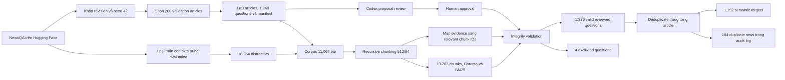

# Khám phá và chuẩn bị dữ liệu NewsQA

## 1. Mục đích

Quá trình chuẩn bị dữ liệu có hai mục tiêu:

1. Hiểu cấu trúc và các hạn chế của dữ liệu NewsQA ban đầu.
2. Tạo một benchmark RAG có thể tái lập, trong đó câu hỏi, đáp án, evidence và
   relevant chunk đều được kiểm tra trước khi chấm điểm.

Benchmark cuối cùng của dự án là `newsqa_200_11064`: 200 bài dùng để đánh giá
và 10.864 bài chỉ dùng làm distractor cho retrieval.

## 2. EDA dữ liệu NewsQA ban đầu

### 2.1. Nguồn dữ liệu

Dự án tải dữ liệu từ
[Hugging Face - `lucadiliello/newsqa`](https://huggingface.co/datasets/lucadiliello/newsqa)
và khóa revision:

```text
728e52920b8e4ffcfaad93fa47556f26a1d82546
```

Đây là bản NewsQA đã được định dạng và lọc cho bài toán Question Answering theo
MRQA. Nội dung là các bài báo tiếng Anh của **CNN**.

Dataset không có trường `article_id`. Mỗi dòng tương ứng với một câu hỏi và
lặp lại toàn bộ article context. Vì vậy, số bài báo được tính bằng số `context`
khác nhau, không phải số dòng.

### 2.2. Phân chia dữ liệu

| Split | Dòng câu hỏi | Exact article contexts | Trung bình câu/bài |
|---|---:|---:|---:|
| Train | 74.160 | 10.895 | 6,8 |
| Validation | 4.212 | 638 | 6,6 |
| Tổng số dòng | 78.372 | | |

Các số trên được tính từ revision đã khóa. Train có 10.670 context duy nhất
sau khi chuẩn hóa chữ thường và khoảng trắng; train và validation có 82
normalized contexts trùng nhau. Điều này cho thấy chỉ đếm chuỗi context chính
xác vẫn có thể bỏ sót các bản sao khác định dạng.

### 2.3. Định dạng ban đầu

Mỗi dòng có năm trường chính:

```json
{
  "context": "Nội dung đầy đủ của bài báo CNN...",
  "question": "When was Pandher sentenced to death?",
  "answers": ["February."],
  "key": "724f6eb9a2814e4fb2d7d8e4de846073",
  "labels": [
    {
      "start": [261],
      "end": [269]
    }
  ]
}
```

- `context`: toàn bộ nội dung bài báo.
- `question`: câu hỏi do người chú thích tạo.
- `answers`: một hoặc nhiều đáp án dạng chuỗi.
- `key`: ID của câu hỏi.
- `labels`: vị trí evidence trong `context`.

Offset `end` của nguồn là inclusive. Pipeline chuyển nó sang quy ước
`[start, end)` và kiểm tra rằng `context[start:end]` khớp chính xác với evidence.

### 2.4. Độ phủ của mẫu evaluation

Với 200 bài validation được chọn:

| Thuộc tính | Giá trị |
|---|---:|
| Tổng câu hỏi | 1.340 |
| Câu hỏi mỗi bài, trung bình | 6,7 |
| Câu hỏi mỗi bài, trung vị | 7 |
| Độ dài bài báo trung bình | 2.947 ký tự |
| Độ dài câu hỏi trung bình | 36,1 ký tự |
| Độ dài đáp án trung bình | 23,6 ký tự |

### 2.5. Chủ đề bài báo

NewsQA không cung cấp nhãn `topic` hoặc `category`, vì vậy dự án không tạo một
phân bố phần trăm chủ đề mang tính suy diễn. Qua nội dung có thể nhận thấy các
nhóm tin tiêu biểu:

- chính trị và chính phủ;
- chiến tranh, xung đột và an ninh;
- pháp luật và tội phạm;
- kinh tế và doanh nghiệp;
- khoa học, công nghệ và môi trường;
- sức khỏe;
- thể thao;
- giải trí và đời sống.

Các nhóm này chỉ mô tả phạm vi nội dung, không phải ground-truth topic labels.

## 3. Quy trình chuẩn bị dữ liệu

### 3.1. Chọn tập evaluation và corpus

Pipeline quét toàn bộ split hai lần:

1. Tạo ID ổn định từ hash của mỗi context.
2. Sắp xếp các ID và lấy mẫu không hoàn lại bằng seed `42`.
3. Quét lại split để lấy **toàn bộ câu hỏi** của mỗi bài đã chọn.

Kết quả lựa chọn:

- 200 trong 638 validation articles làm evaluation set;
- 1.340 câu hỏi thuộc 200 bài trên;
- 31 train contexts trùng với evaluation sample bị loại;
- 10.864 train articles còn lại làm retrieval distractors;
- corpus cuối có 11.064 bài.

Các artifact trung gian được lưu riêng:

```text
staging/corpus/evaluation_articles.jsonl
staging/corpus/distractor_articles.jsonl
staging/questions/original_questions.jsonl
evaluation/manifests/newsqa_200_11064.selection.json
```

Manifest ghi dataset revision, seed, ID đã chọn, thống kê, hash và phiên bản
script để có thể tái tạo đúng tập dữ liệu.

### 3.2. Chunking và indexing

Toàn bộ 11.064 bài được xử lý bằng cùng chiến lược với RAG pipeline:

| Thành phần | Cấu hình |
|---|---|
| Chunking | Recursive token splitting |
| Chunk size | 512 tokens |
| Chunk overlap | 64 tokens |
| Embedding | `all-MiniLM-L6-v2` |
| Vector dimensions | 384 |
| Tổng chunks | 19.263 |

Mỗi chunk có ID ổn định dạng:

```text
<short_article_id>_chunk_<index>
```

Cùng 19.263 chunks được dùng để tạo:

- `chunks.jsonl` cho provenance và đánh giá;
- BM25 index cho sparse/hybrid retrieval;
- Chroma collection cho dense retrieval.

### 3.3. Ánh xạ evidence sang relevant chunk

Evidence span vẫn được giữ nguyên để kiểm tra provenance và đáp án. Pipeline
không xóa evidence để thay bằng chunk ID, mà bổ sung `relevant_chunk_ids` dùng
cho retrieval evaluation.

Một chunk được xem là relevant khi khoảng ký tự của nó giao với ít nhất một
reviewed evidence span:

```text
chunk_start < evidence_end AND evidence_start < chunk_end
```

Nhờ đó retrieval có thể được chấm bằng Hit Rate, Recall, MRR và NDCG trên
chính các chunk đã được đưa vào database.

## 4. Codex và human review

### 4.1. Chuẩn bị review packets

Mỗi packet chứa tối đa 20 bài và 150 câu hỏi. Với từng câu hỏi, packet cung cấp:

- toàn bộ bài báo;
- câu hỏi, source answer và exact evidence offsets;
- năm đoạn cạnh tranh được xếp hạng cao từ corpus 11.064 bài.

Prompt thao tác cho Codex:

```text
Review packet review_NNN as a Codex proposal-only batch. Inspect the full
article and every question in the packet, apply the Codex proposal contract in
this guide, write an exact-coverage proposal file under
staging/review/proposals/, apply it to review_queue_readable.json with an
immutable packet audit, and validate the result. Do not make any human-review
decision; leave every human_review.decision as pending.
```

Review của bộ dữ liệu này được đề xuất bằng `codex-cli` / `sol-5.6`, sau đó
được con người kiểm tra và phê duyệt.

### 4.2. Codex proposal contract

Với **mọi câu hỏi**, Codex phải:

1. Gán nhãn `standalone`, `non_standalone`, `invalid` hoặc `uncertain`.
2. Kiểm tra câu hỏi mơ hồ, thiếu chủ thể, sai ngữ pháp hoặc thiếu sự kiện.
3. Kiểm tra đáp án bị cắt, sai đáp án, sai evidence và yes/no mismatch.
4. Đề xuất clarification tối thiểu khi câu hỏi không standalone.
5. Cung cấp exact non-answer quotes cho mọi thông tin được thêm vào câu hỏi.
6. Ghi model, tool, batch, thời gian, rationale và issue codes.

Các trường nguồn sau là bất biến:

```text
original_question
source_expected_answer
source_evidence_spans
```

Nếu sửa đáp án, proposal phải cập nhật `expected_answer`, `accepted_answers`,
`evidence_spans` và `evidence_text`, đồng thời ghi rõ lý do. Clarification chỉ
được thêm thông tin nhận diện từ bài báo và không được tiết lộ đáp án.

Chỉ loại câu hỏi khi:

- thông tin được hỏi không có trong bài;
- câu hỏi và đáp án sai mục tiêu ngữ nghĩa, không thể sửa mà vẫn giữ ý nghĩa;
- không tồn tại một gold answer duy nhất có thể bảo vệ được.

### 4.3. Human approval

Con người đọc article, source fields và Codex proposal rồi chọn:

| Decision | Ý nghĩa |
|---|---|
| `mark_standalone` | Giữ nguyên wording, chấp nhận answer/evidence đã review |
| `approve` | Chấp nhận clarification của Codex |
| `edit` | Sửa clarification trước khi chấp nhận |
| `exclude` | Loại khỏi tập chấm điểm và ghi lý do |
| `needs_adjudication` | Chưa thống nhất, chưa được finalize |

Finalization bị chặn nếu còn `pending`, `needs_adjudication`, evidence offset
không hợp lệ hoặc correction không có giải thích.

## 5. EDA sau khi review

### 5.1. Kết quả tổng quát

| Kết quả | Số câu hỏi |
|---|---:|
| Source questions được review | 1.340 |
| Giữ wording gốc | 258 |
| Có clarified wording được duyệt | 1.078 |
| Answer/evidence được sửa hoặc chuẩn hóa | 298 |
| Bị loại | 4 |
| Còn lại trong benchmark chính | 1.336 |

`298` không có nghĩa là có 298 đáp án hoàn toàn sai. Con số này gồm cả sửa
đáp án sai, mở rộng span bị cắt, sửa evidence, bỏ dấu câu và chuẩn hóa đáp án
để phù hợp với dạng câu hỏi.

### 5.2. Deduplicate sau review

Deduplication được thực hiện **sau khi** sửa câu hỏi, đáp án và evidence để so
sánh trên wording đã resolved. Chỉ các câu trong cùng một article và cùng hỏi
một answer-bearing fact mới được gộp; kết quả RAG không được dùng để ra quyết
định. Codex đề xuất các cluster và con người phê duyệt toàn bộ 155 cluster trước
khi tạo output.

| Bước | Số câu hỏi |
|---|---:|
| Câu hỏi nguồn | 1.340 |
| Loại vì không có gold target hợp lệ | 4 |
| Hợp lệ trước deduplicate | 1.336 |
| Bản ghi trùng ngữ nghĩa chuyển sang audit log | 184 |
| Semantic targets dùng để chấm | 1.152 |
| Clarified subset sau deduplicate | 924 |

Mỗi cụm giữ một representative có ID ổn định và hợp nhất các accepted answers,
evidence spans và relevant chunk IDs đã review. Toàn bộ 1.340 source questions,
review annotations và 184 bản ghi bị gộp vẫn được lưu để đảm bảo provenance.
Corpus 11.064 bài, 19.263 chunks và retrieval indexes không thay đổi.
Partition được phát hiện trên resolved wording nhưng áp dụng giống nhau cho
reviewed-original và resolved set; raw source set không bị deduplicate.

### 5.3. Các vấn đề nổi bật

| Issue code | Số lần xuất hiện |
|---|---:|
| `missing_subject` | 688 |
| `underspecified_event` | 139 |
| `generic_reference` | 98 |
| `wrong_evidence` | 87 |
| `malformed_question` | 71 |
| `truncated_answer` | 59 |
| `wrong_answer` | 35 |
| `yes_no_answer_mismatch` | 4 |

Các issue code có thể chồng lấp: một câu hỏi có thể vừa thiếu chủ thể, vừa có
đáp án hoặc evidence sai.

### 5.4. Ví dụ lỗi và cách xử lý

#### Ví dụ 1: 35.000 quân Canada

```text
Question: How many troops does Canada have in Afghanistan?
Source answer: 35,000
Reviewed answer: more than 2,800 Canadian troops
```

Bài báo nói Mỹ có khoảng 62.000 quân và các đồng minh NATO, **bao gồm Canada**,
có thêm 35.000 quân. Ở đoạn sau, bài báo nêu riêng Afghanistan có “more than
2,800 Canadian troops”. Vì vậy `35,000` là tổng của các đồng minh NATO, không
phải số quân Canada. Answer và evidence được chuyển sang đoạn 2.800 quân.

#### Ví dụ 2: đáp án bị cắt

```text
Question: Where is Nancy Reagan being treated?
Source answer: Ronald
Reviewed answer: Ronald Reagan UCLA Medical Center
```

Source span chỉ lấy từ đầu tiên của tên bệnh viện. Review mở rộng span thành tên
đầy đủ để tạo một gold answer có ý nghĩa.

#### Ví dụ 3: yes/no answer không đúng dạng

```text
Question: Did hijacker try to steal a car?
Source answer: his
Reviewed answer: Yes
Evidence: someone tried to steal his car
```

`his` không trả lời được một câu hỏi yes/no. Review chuẩn hóa đáp án thành
`Yes`, giữ proposition đầy đủ làm evidence và làm rõ sự kiện Lucky Dube trong
question variant.

#### Ví dụ 4: thông tin không có trong bài

```text
Question: What is the cost of the conveyor belts?
Source answer: $5.5 billion
Decision: exclude
```

Bài báo chỉ nói **toàn bộ nhà máy**, gồm 35 km băng chuyền và các kho chứa,
được Hyundai Steel xây với chi phí khoảng 5,5 tỷ USD. Bài không cho biết chi
phí riêng của băng chuyền. Sửa câu hỏi thành chi phí nhà máy sẽ thay đổi semantic
target, nên hai câu hỏi về chi phí băng chuyền bị loại.

### 5.5. Bốn câu hỏi bị loại

| Nhóm | Số câu | Lý do |
|---|---:|---|
| Chi phí conveyor belts | 2 | Bài chỉ có chi phí toàn nhà máy |
| Thời điểm tham gia talent show | 1 | Fact được hỏi không có trong bài |
| “who won the record” | 1 | Câu hỏi mơ hồ, không có gold answer duy nhất |

Exclusion được lưu và báo cáo công khai, không bị xóa âm thầm khỏi provenance.

## 6. Dữ liệu đầu ra

| Tệp/artifact | Quy mô | Mục đích |
|---|---:|---|
| `testset_original.jsonl` | 1.340 | Bản NewsQA bất biến để đối chiếu |
| `testset_reviewed_original.jsonl` | 1.336 | Benchmark chính, wording gốc và gold đã review |
| `testset_resolved.jsonl` | 1.336 | Cùng câu hỏi nhưng dùng clarification khi được duyệt |
| `testset_clarified.jsonl` | 1.078 | Paired subset để đo tác động của clarification |
| `final_deduplicated/testset_reviewed_original.jsonl` | 1.152 | Benchmark wording gốc, mỗi semantic target tính một lần |
| `final_deduplicated/testset_resolved.jsonl` | 1.152 | Bản resolved đã deduplicate, dùng để chấm chính |
| `final_deduplicated/duplicate_questions.jsonl` | 184 | Audit các bản ghi được gộp |
| `final_deduplicated/question_clusters.jsonl` | 1.152 | Toàn bộ semantic clusters, kể cả singleton |
| `excluded_questions.jsonl` | 4 | Câu bị loại và lý do |
| `review_annotations.jsonl` | 1.340 | Toàn bộ proposal, correction và human decision |
| `chunks.jsonl` | 19.263 | Corpus chunks và metadata |
| `bm25.pkl` | 19.263 chunks | Sparse retrieval index |
| Chroma collection | 19.263 vectors | Dense retrieval index |
| `integrity_report.json` | 1 file | Kiểm tra count và trạng thái hoàn tất |

Benchmark đã deduplicate là lựa chọn chính để mỗi information need chỉ có một
trọng số. Bản 1.336 câu vẫn được giữ để đối chiếu và tái tạo provenance. Trong
mỗi phiên bản, so sánh `testset_reviewed_original.jsonl` với
`testset_resolved.jsonl` cho biết clarification có cải thiện retrieval và
generation hay không mà không thay đổi corpus.

Chroma collection tương ứng là `newsqa_val200_s42_7e16e8_66785e`. Manifest
selection và variant lưu hash của các artifact, cấu hình pipeline và count cần
thiết để phát hiện việc ghép nhầm testset với index.

## 7. Flowchart chuẩn bị dữ liệu



Quy trình giữ riêng dữ liệu nguồn, proposal, human decision và output cuối để
mọi thay đổi đều có thể truy vết.
