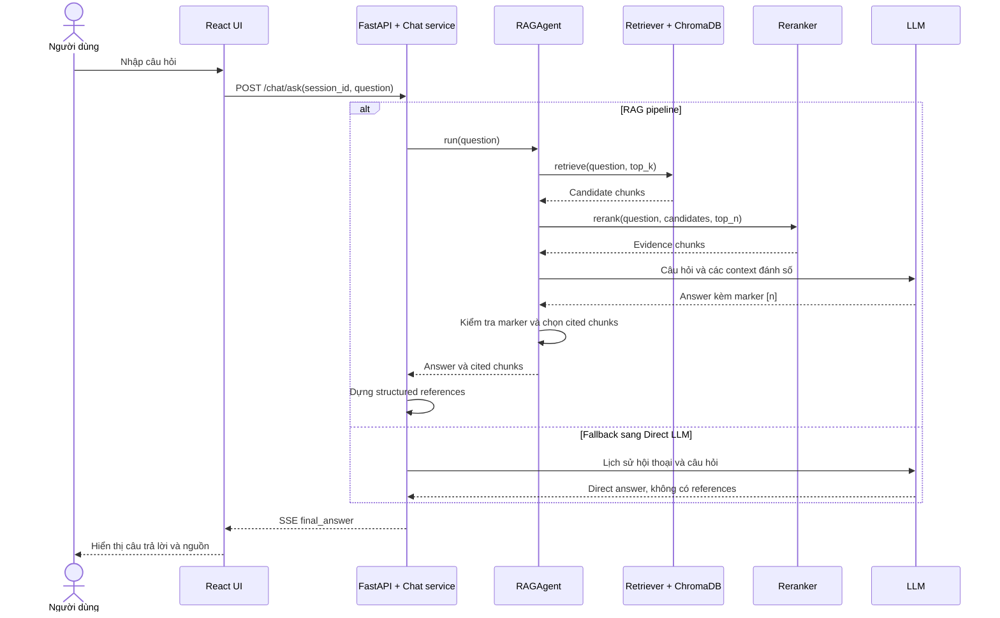

# Định nghĩa bài toán và kiến trúc hệ thống

## 1. Định nghĩa bài toán

Dự án xây dựng một hệ thống **Retrieval-Augmented Generation (RAG)** để trả
lời câu hỏi trên một kho bài báo tin tức cố định.

Nếu chỉ sử dụng mô hình ngôn ngữ lớn (LLM), câu trả lời có thể hợp lý về mặt
ngôn ngữ nhưng không được hỗ trợ bởi dữ liệu trong kho tin tức. Ngược lại, một
hệ thống truy xuất thông thường chỉ trả về các đoạn văn bản liên quan, chưa tạo
ra câu trả lời trực tiếp và dễ hiểu cho người dùng.

Hệ thống RAG kết hợp hai khả năng trên theo quy trình:

1. Truy xuất các đoạn tin tức có liên quan đến câu hỏi.
2. Sắp xếp lại các đoạn theo mức độ liên quan.
3. Cung cấp các đoạn đã chọn cho LLM làm bằng chứng.
4. Sinh câu trả lời kèm nguồn tham chiếu để người dùng kiểm chứng.

Đây là một bài toán nghiên cứu và thực nghiệm, không chỉ là xây dựng chatbot.
Kiến trúc phải cho phép thay thế và đánh giá riêng các thành phần như chunking,
embedding, retrieval, reranking và generation trong cùng một quy trình có thể
tái lập.

### 1.1. Mục tiêu

- Tạo câu trả lời dựa trên bằng chứng được truy xuất từ kho tin tức.
- Cung cấp nguồn tham chiếu để kiểm tra nội dung câu trả lời.
- Hạn chế hallucination bằng cách yêu cầu LLM chỉ sử dụng context được cung cấp.
- Xây dựng kiến trúc mô-đun để có thể thay đổi từng thành phần độc lập.
- Đánh giá retrieval và generation riêng biệt để xác định lỗi phát sinh ở bước
  nào.
- Bảo đảm benchmark có thể tái lập và tiếp tục sau khi bị gián đoạn.

### 1.2. Phạm vi hiện tại

Hệ thống hiện tại là **RAG pipeline tuyến tính**, chưa phải Agentic RAG.

`RAGAgent` thực hiện một chuỗi hành động cố định:

```text
retrieve -> rerank -> generate -> map citations
```

Nó chưa tự lập kế hoạch, tự chọn công cụ, viết lại truy vấn hay quyết định truy
xuất nhiều vòng. `src/agents/orchestrator.py` và các tệp trong `src/tools/` hiện
chưa chứa logic điều phối hoạt động. Các sự kiện `tool_call` trên giao diện chỉ
mô tả tiến trình của pipeline cố định, không phải quá trình suy luận của một
agent.

Agentic RAG là hướng mở rộng trong tương lai, sau khi pipeline RAG cơ sở đã được
đánh giá ổn định.

## 2. Đầu vào và đầu ra toàn hệ thống

### 2.1. Luồng hỏi đáp trực tuyến

**Đầu vào từ người dùng:** một câu hỏi ngôn ngữ tự nhiên và mã phiên hội thoại.

```json
{
  "session_id": "mã phiên hội thoại",
  "question": "câu hỏi của người dùng"
}
```

Pipeline còn sử dụng trạng thái đã cấu hình trước, gồm embedding model,
ChromaDB collection, phương pháp retrieval, `top_k`, reranker, `top_n` và
generation model. Người dùng chỉ nhập câu hỏi; LLM không tự lựa chọn các thuật
toán này.

**Đầu ra cho người dùng:** câu trả lời và danh sách nguồn tham chiếu.

```json
{
  "answer": "Câu trả lời dựa trên bằng chứng [1].",
  "citations": [
    {
      "source": "CNN",
      "title": "Tiêu đề bài báo",
      "date": "Ngày đăng",
      "url": "Đường dẫn bài báo",
      "chunk_text": "Đoạn văn bản được dùng làm bằng chứng"
    }
  ]
}
```

Kết quả HTTP được truyền dần bằng Server-Sent Events (SSE), gồm các loại sự
kiện `tool_call`, `tool_result`, `thought` và `final_answer`. UI chỉ xem
`final_answer` là kết quả cuối cùng.

Bên trong hệ thống, pipeline giữ thêm trace phục vụ phân tích và đánh giá:

```python
{
    "question": str,
    "retrieved_chunks": list[dict],
    "reranked_chunks": list[dict],
    "contexts": list[str],
    "answer": str,
    "citation_chunk_ids": list[str],
    "invalid_citation_indices": list[int],
    "timing_ms": {
        "retrieve_ms": float,
        "rerank_ms": float,
        "llm_ms": float,
        "total_ms": float,
    },
}
```

Nếu RAG không khởi tạo được trong ứng dụng, `chat_service` có thể chuyển sang
direct LLM. Kết quả fallback không có citation và không được xem là kết quả RAG
trong benchmark.

### 2.2. Luồng xây dựng corpus ngoại tuyến

**Đầu vào:** bài báo HTML hoặc article context từ NewsQA.

**Đầu ra:**

| Artifact | Nội dung | Thành phần sử dụng |
|---|---|---|
| Cleaned article | Nội dung sạch và metadata bài báo | Chunking |
| Chunk JSONL | ID, text và metadata của từng chunk | BM25 và evaluation |
| Chroma collection | Vector, text và metadata | Dense retrieval |
| BM25 pickle | Chỉ mục tìm kiếm theo từ khóa | BM25/hybrid retrieval |
| Manifest | Cấu hình, seed, corpus và fingerprint | Kiểm tra tính tương thích |

### 2.3. Luồng đánh giá ngoại tuyến

**Đầu vào:** testset gồm câu hỏi, đáp án tham chiếu, evidence và relevant chunk
IDs; cấu hình pipeline và corpus tương ứng.

**Đầu ra:** retrieval traces, generation predictions, attempt logs, kết quả LLM
judge và report tổng hợp các metric. Các checkpoint JSONL cho phép dừng và tiếp
tục benchmark mà không chạy lại các câu đã thành công.

## 3. Phân rã kiến trúc

Theo trách nhiệm vận hành, repo hiện tại được chia thành **9 mô-đun chính**.

| STT | Mô-đun | Vai trò | Đầu vào | Đầu ra | Mã nguồn chính |
|---:|---|---|---|---|---|
| 1 | Giao diện người dùng | Nhận câu hỏi, hiển thị lịch sử, tiến trình, câu trả lời và nguồn | Thao tác người dùng, SSE từ API | HTTP request và giao diện kết quả | `ui/src/` |
| 2 | API và service | Quản lý session, gọi pipeline, stream kết quả | `session_id`, `question` | SSE events và lịch sử hội thoại | `api/`, `src/services/` |
| 3 | Ingestion | Đọc HTML, trích xuất text/metadata và chia bài báo thành chunk | Raw HTML hoặc article context | Các chunk đã chuẩn hóa | `src/ingestion/` |
| 4 | Indexing và lưu trữ | Sinh embedding, lưu vector và tạo BM25 index | Danh sách chunk | Chroma collection, BM25 index | `src/indexing/` |
| 5 | Retrieval | Tìm chunk bằng dense, BM25 hoặc hybrid RRF | Câu hỏi, `top_k` | Candidate chunks đã xếp hạng | `src/retrieval/` |
| 6 | Reranking | Chấm điểm lại candidate hoặc giữ thứ tự baseline | Câu hỏi, candidates, `top_n` | Evidence chunks theo thứ tự mới | `src/retrieval/reranker.py` |
| 7 | Generation và citation | Sinh câu trả lời từ context đánh số và ánh xạ `[n]` về chunk | Câu hỏi, contexts | Answer, citation IDs, cited chunks | `src/llm.py` |
| 8 | Điều phối RAG | Chạy pipeline cố định và ghi trace/thời gian | Câu hỏi và các component đã cấu hình | Full RAG trace | `src/agents/rag_agent.py` |
| 9 | Evaluation và benchmark | Thu prediction, tính metric, LLM judging và resume | Testset, ground truth, RAG traces | Checkpoint JSONL và report | `src/evaluation/`, `scripts/*benchmark*` |

### 3.1. Ingestion

`NewsCleaner` dùng `newspaper3k` để lấy nội dung và metadata từ HTML.
`TextChunker` chia bài báo bằng recursive token splitting, tạo ID ổn định theo
dạng `<article_id>_chunk_<index>` và sao chép metadata vào từng chunk.

```python
{
    "id": "<article_id>_chunk_<index>",
    "text": str,
    "metadata": {
        "article_id": str,
        "chunk_index": int,
        "title": str,
        "url": str,
        "publish_date": str,
        "publisher": str,
        "author": str,
    },
}
```

Chunk ID là khóa liên kết giữa ChromaDB, BM25 và nhãn relevant chunk của bộ dữ
liệu đánh giá.

### 3.2. Indexing và lưu trữ

Embedding module hỗ trợ Sentence Transformer chạy local hoặc endpoint tương
thích OpenAI. `ChromaStore` lưu vector, document và metadata theo batch. BM25
index lưu biểu diễn từ khóa cho sparse retrieval.

### 3.3. Retrieval

Mọi retriever tuân theo giao diện:

```python
retrieve(query: str, top_k: int) -> list[dict]
```

- Dense retrieval: embedding câu hỏi và tìm vector gần nhất trong ChromaDB.
- BM25 retrieval: xếp hạng theo mức độ khớp từ khóa.
- Hybrid retrieval: kết hợp dense và BM25 bằng Reciprocal Rank Fusion.

Core và benchmark hỗ trợ cả ba phương pháp. Tuy nhiên, đường chat trên UI hiện
tại khởi tạo **dense retriever** trên collection `newsqa_cnn`; BM25 và hybrid
được sử dụng qua CLI/benchmark khi cấu hình tương ứng.

### 3.4. Reranking

```python
rerank(query: str, results: list[dict], top_n: int) -> list[dict]
```

- `NoOpReranker`: giữ nguyên thứ tự, dùng làm baseline.
- `CrossEncoderReranker`: chấm điểm từng cặp `(question, chunk)` rồi xếp lại.

Factory đọc khóa `retrieval.reranker.type`. Cấu hình UI hiện tại chưa có khóa
này nên thực tế dùng `NoOpReranker`; benchmark có thể bật Cross-Encoder một
cách tường minh.

### 3.5. Generation và citation

LLM nhận câu hỏi và các context được đánh số `[1]`, `[2]`, ... Prompt yêu cầu
chỉ trả lời bằng thông tin trong context và gắn citation cho các phát biểu.

Sau khi nhận câu trả lời, `RAGAgent` tìm marker `[n]`, loại chỉ số ngoài phạm vi
và ánh xạ marker hợp lệ sang chunk tương ứng. Code hiện tại chưa gọi lại LLM để
sửa citation. Ở lớp service, nếu không có cited chunk hợp lệ, các reranked chunk
được dùng làm danh sách nguồn hiển thị.

### 3.6. Điều phối RAG

`RAGAgent` nối retriever, reranker và LLM qua hai bước có thể checkpoint:

```text
retrieve_and_rerank(question) -> retrieval trace
generate_from_trace(trace)    -> answer và citations
```

Việc tách hai bước cho phép benchmark dùng lại retrieval trace khi generation
gặp lỗi API, thay vì phải truy xuất lại.

### 3.7. API, service và UI

React UI gửi `POST /chat/ask` đến FastAPI. Router lưu user message, gọi
`chat_service`, chuyển từng event thành SSE và lưu assistant message khi stream
kết thúc. `chat_service` chạy theo mode cố định `auto`, `direct` hoặc `rag`.
Đây là routing theo cấu hình, không phải agent tự phân tích câu hỏi để chọn hành
động.

### 3.8. Evaluation và benchmark

Evaluation chạy ngoại tuyến và không nằm trên request path của người dùng. Hệ
thống đánh giá:

- ingestion/indexing: thống kê chunk, metadata, duplicate và self-retrieval;
- retrieval: Hit Rate, Recall, MRR và NDCG;
- reranking: thay đổi MRR/NDCG trước và sau reranking;
- generation: Exact Match, token F1 và đánh giá bằng LLM;
- citation: validity, precision, recall, F1 và coverage;
- vận hành: success rate và latency từng giai đoạn.

## 4. Flowchart tổng thể

```mermaid
flowchart LR
    subgraph OFFLINE[Chuẩn bị corpus - offline]
        RAW[Raw HTML hoặc NewsQA context]
        CLEAN[Làm sạch text và metadata]
        CHUNK[Chia chunk và gán ID]
        CHUNKS[(Chunk JSONL)]
        EMBED[Embedding]
        CHROMA[(ChromaDB)]
        BM25[(BM25 index)]

        RAW --> CLEAN --> CHUNK --> CHUNKS
        CHUNKS --> EMBED --> CHROMA
        CHUNKS --> BM25
    end

    subgraph ONLINE[Hỏi đáp online]
        USER[Người dùng]
        UI[React UI]
        API[FastAPI]
        SERVICE[Chat service]
        COORD[RAGAgent - pipeline cố định]
        RETRIEVE[Dense retrieval hiện tại]
        RERANK[Reranker]
        LLM[Grounded LLM]
        CITE[Ánh xạ citation markers]
        ANSWER[Câu trả lời và nguồn]
        DIRECT[Direct LLM fallback]

        USER -->|question| UI
        UI -->|POST /chat/ask| API
        API --> SERVICE
        SERVICE -->|RAG khả dụng| COORD
        COORD --> RETRIEVE
        RETRIEVE -->|top-k chunks| RERANK
        RERANK -->|top-n contexts| LLM
        LLM --> CITE --> ANSWER
        SERVICE -.->|RAG không khả dụng| DIRECT
        DIRECT -->|không citation| ANSWER
        ANSWER -->|SSE qua API| UI
    end

    subgraph EVAL[Đánh giá offline]
        TESTSET[NewsQA testset]
        COLLECT[Thu predictions]
        SCORE[Chấm điểm xác định]
        JUDGE[LLM judge]
        REPORT[(Report JSON)]
        DASH[Evaluation dashboard]

        TESTSET --> COLLECT
        COLLECT --> SCORE --> REPORT
        COLLECT --> JUDGE --> REPORT
        REPORT --> DASH
    end

    CHROMA --> RETRIEVE
    CHROMA --> COLLECT
    BM25 --> COLLECT
```



Flowchart tách ba quy trình: xây dựng corpus, phục vụ người dùng và đánh giá
ngoại tuyến. BM25/hybrid đã có trong core và benchmark, còn chat UI hiện tại sử
dụng dense retrieval.

## 5. Sequence diagram cho một câu hỏi



## 6. Hướng mở rộng Agentic RAG

Sau khi pipeline cơ sở có benchmark ổn định, lớp orchestrator trong tương lai
có thể:

- phân loại câu hỏi để quyết định có cần retrieval hay không;
- viết lại truy vấn khi lần truy xuất đầu chưa đủ bằng chứng;
- thực hiện nhiều vòng truy xuất và hợp nhất kết quả;
- chọn dense, BM25, hybrid hoặc công cụ khác theo từng câu hỏi;
- đánh giá mức độ đầy đủ của bằng chứng trước khi sinh câu trả lời.

Phần mở rộng này là một biến thể thực nghiệm mới. Nó không thay đổi các hợp
đồng retrieval, reranking, generation và evaluation của pipeline RAG hiện tại.
