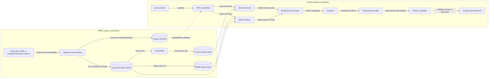
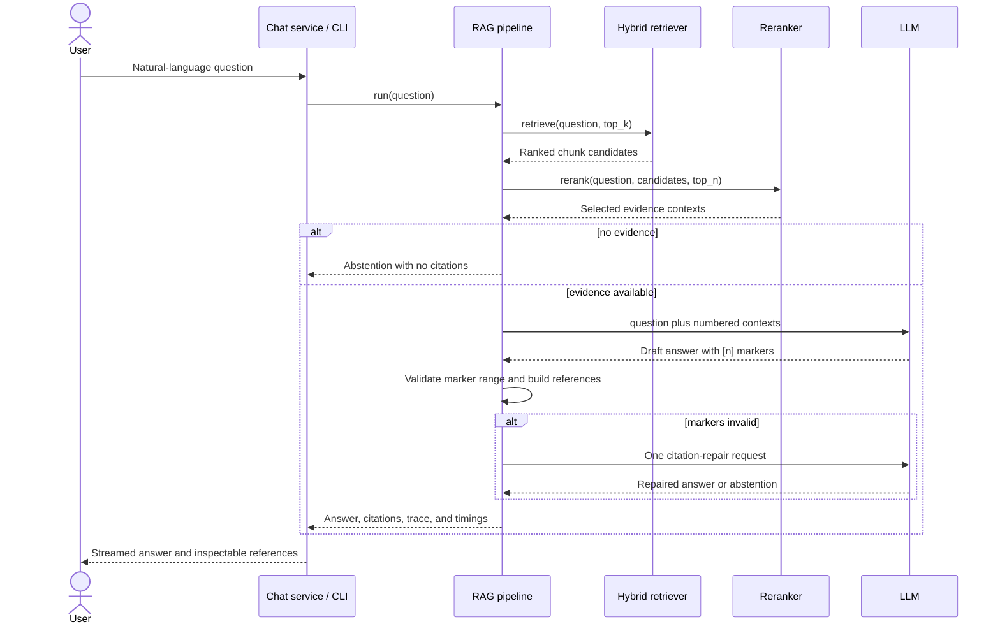

# Problem Definition and System Architecture

## 1. Problem Statement

News question answering requires a system to identify evidence in a news
corpus, formulate an answer from that evidence, and expose the provenance of
the answer. A language model used without retrieval may produce statements
that are plausible but unsupported by the available articles. Conversely, a
retrieval system alone returns passages rather than a concise answer.

This project studies a **modular retrieval-augmented generation (RAG)
pipeline for question answering over news articles**. The system combines
document processing, dense and sparse retrieval, result fusion, optional
reranking, evidence-constrained generation, citation validation, and offline
evaluation. The initial evaluation dataset is NewsQA.

The current object of study is a deterministic base RAG pipeline. Autonomous
agent planning, repeated tool selection, and live web acquisition are future
extensions and are not required for the base-pipeline experiments.

## 2. Objectives

### 2.1 Primary objective

Given a natural-language question and a fixed corpus of news articles, produce
an answer that is supported by retrieved passages and accompanied by
references that allow the supporting evidence to be inspected.

### 2.2 Design and research objectives

1. **Grounded answering:** constrain generation to retrieved news passages and
   abstain when the passages do not contain sufficient evidence.
2. **Traceable provenance:** associate answer claims with numbered citations
   and return the corresponding article metadata and passage text.
3. **Modularity:** define stable interfaces between ingestion, indexing,
   retrieval, reranking, generation, and evaluation so that one component can
   be replaced without rewriting the rest of the pipeline.
4. **Controlled comparison:** record the effective corpus, chunking,
   embedding, retrieval, and generation configuration for every experiment.
5. **Independent evaluation:** measure retrieval separately from answer
   generation to distinguish evidence-selection failures from generation
   failures.
6. **Reproducibility:** build vector, sparse, chunk, and ground-truth artifacts
   from the same corpus and reject incompatible cached artifacts.
7. **Operational accessibility:** expose the same pipeline through a Python
   interface, command-line interface, HTTP API, and browser UI.

The goal is not to advertise a general-purpose news chatbot. It is to provide
an experimental system in which the contribution of individual RAG components
can be measured under a consistent data and evaluation protocol.

## 3. Whole-System Input and Output

### 3.1 Online question-answering input

The externally supplied input is:

```text
question: non-empty natural-language string
```

The complete runtime input also includes fixed experimental state:

```python
{
    "question": str,
    "config": {
        "embedding": dict,
        "retrieval": dict,
        "llm": dict,
        "storage": dict,
    },
    "corpus_artifacts": {
        "chroma_collection": str,
        "chunks_jsonl": str,
        "bm25_index": str,
        "manifest": str,
    },
}
```

The question does not directly select algorithms. Algorithm choice and
parameters are part of the experiment configuration, which prevents different
requests in one experimental run from silently using different pipelines.

### 3.2 Online question-answering output

The core pipeline returns:

```python
{
    "question": str,
    "answer": str,                 # includes valid [n] markers, or abstention
    "citations": [
        {
            "source": str,
            "title": str,
            "date": str,
            "url": str,
            "chunk_text": str,
        }
    ],
    "retrieved_chunks": list[dict],
    "reranked_chunks": list[dict],
    "contexts": list[str],
    "abstained": bool,
    "timing_ms": {
        "retrieve_ms": float,
        "rerank_ms": float,
        "llm_ms": float,
        "total_ms": float,
    },
}
```

The user-facing API exposes the answer and citations. Retrieved passages and
timings are retained as an experimental trace and are available to evaluation
and debugging interfaces.

At the HTTP boundary, a request has the form:

```json
{"session_id": "<conversation identifier>", "question": "<user question>"}
```

The response is an SSE stream of `tool_call`, `tool_result`, and
`final_answer` events. The final event contains the answer and structured
citations. The CLI exposes the same final result without SSE framing.

### 3.3 Offline corpus-building input and output

Corpus building accepts either raw news HTML or a prepared chunk JSONL file.
It produces four mutually consistent artifacts:

| Artifact | Content | Consumer |
|---|---|---|
| Chroma collection | Dense vectors, text, and metadata | Dense retriever |
| Chunk JSONL | Canonical chunk records | BM25 lookup and evaluation |
| BM25 pickle | Tokenized sparse index and chunk-ID map | Sparse retriever |
| Corpus manifest | Configuration signature and corpus statistics | Runtime validation |

### 3.4 Offline evaluation input and output

Evaluation accepts test entries containing a question, one or more reference
answers, and relevant chunk IDs. It returns a report containing the effective
configuration and aggregate retrieval and QA metrics.

## 4. Architectural Decomposition

The implemented base system contains **nine operational modules**. A future
agent-orchestration module is described separately because it is not part of
the current evaluation target.

| No. | Module | Responsibility | Principal implementation |
|---:|---|---|---|
| 1 | Configuration and artifact governance | Load configuration, resolve paths, fingerprint corpus settings, and reject incompatible artifacts | `configs/setting.py` |
| 2 | Ingestion and chunking | Extract article text and metadata, assign stable IDs, and split articles into overlapping passages | `src/ingestion/` |
| 3 | Indexing | Embed chunks, persist the Chroma collection, and construct the BM25 index | `src/indexing/` |
| 4 | Retrieval | Run dense and sparse searches and combine rankings with reciprocal rank fusion | `src/retrieval/` |
| 5 | Reranking | Transform a retrieved candidate ranking into the context ranking supplied to generation | `src/retrieval/reranker.py` |
| 6 | Generation and citation policy | Generate an evidence-constrained answer, repair invalid citation markers once, and abstain when validation fails | `src/llm.py`, `src/agents/rag_agent.py` |
| 7 | RAG coordination | Construct configured components and execute retrieve, rerank, generate, validate, and trace | `src/pipeline.py`, `RAGAgent` |
| 8 | Service and presentation | Stream pipeline events, store chat history, expose HTTP/CLI interfaces, and display answers and references | `src/services/`, `api/`, `scripts/query.py`, `ui/` |
| 9 | Evaluation | Prepare NewsQA ground truth and compute retrieval and answer-quality metrics | `src/evaluation/`, `scripts/run_benchmark.py` |

The name `RAGAgent` is retained in the code for compatibility, but its current
behavior is a deterministic pipeline. It does not autonomously select tools.

## 5. Module Interfaces

### 5.1 Canonical chunk contract

Ingestion passes indexing a list of records with the following shape:

```python
{
    "id": "<article_id>_chunk_<index>",
    "text": str,
    "metadata": {
        "article_id": str,
        "chunk_index": int,
        "title": str,
        "url": str,
        "publish_date": str,
        "publisher": str,
        "author": str,
    },
}
```

Chunk IDs are the join key between Chroma, BM25, NewsQA relevance labels, and
evaluation output.

### 5.2 Retrieval contract

Every retriever implements:

```python
retrieve(query: str, top_k: int) -> list[dict]
```

Each returned item contains `id`, `text`, `metadata`, and a ranking `score`.
Dense results may additionally contain `distance`; hybrid results may contain
`dense_score` and `bm25_score`. Results are ordered from most to least
relevant.

### 5.3 Reranking contract

```python
rerank(query: str, results: list[dict], top_n: int) -> list[dict]
```

The current baseline is a no-op reranker, which preserves retrieval order and
truncates the candidate set. The interface permits later cross-encoder or API
rerankers to be evaluated without changing generation.

### 5.4 Generation contract

```python
generate_rag_answer(question: str, contexts: list[str]) -> str
```

Contexts are numbered in their supplied order. A non-abstaining answer must
contain at least one valid marker in the range `[1]` to `[len(contexts)]`.
Only referenced contexts are converted into structured citations.

### 5.5 Evaluation contract

```python
{
    "question": str,
    "ground_truth": str,
    "ground_truths": list[str],
    "relevant_chunk_ids": list[str],
    "article_chunk_ids": list[str],
}
```

Retrieval is evaluated using Hit Rate, MRR, Recall, and NDCG at configured
cutoffs. Generation is evaluated using normalized exact match and token F1,
taking the maximum score across valid reference answers.

### 5.6 Interaction matrix

| Producer | Consumer | Input to interaction | Output from interaction |
|---|---|---|---|
| Configuration module | Corpus builder and pipeline factory | YAML path and optional runtime overrides | Configuration dictionary, resolved artifact paths, and validated manifest |
| Raw-data source | Ingestion | HTML bytes or NewsQA article context | Clean article text and normalized metadata |
| Ingestion | Indexing | Canonical chunk list | Persisted chunk JSONL, dense collection, BM25 index, and manifest |
| Service or CLI | RAG coordinator | Non-empty question string | Pipeline result or controlled error response |
| RAG coordinator | Hybrid retriever | Question and `top_k` | Ordered candidate chunks with fused scores |
| Dense retriever | Embedding function | One query string | One query vector |
| Dense retriever | Chroma | Query vector and result limit | IDs, documents, metadata, and vector distances |
| Sparse retriever | BM25 | Tokenized question and result limit | Chunk IDs and BM25 scores |
| Dense and sparse retrievers | RRF fusion | Two ordered rankings and configured weights | One deduplicated hybrid ranking |
| RAG coordinator | Reranker | Question, hybrid candidates, and `top_n` | Selected ordered evidence chunks |
| RAG coordinator | Generator | Question and numbered context strings | Draft answer with citation markers or abstention |
| Citation validator | Generator | Invalid draft plus the same evidence, at most once | Repaired cited answer or abstention |
| RAG coordinator | Service or CLI | Validated answer, cited chunks, trace, and timings | SSE events, chat history record, or terminal output |
| Test-set builder | Evaluation | NewsQA questions, reference answers, and aligned chunk IDs | Scorable evaluation entries |
| Evaluation | Report writer | Relevant IDs, retrieved IDs, predictions, references, and config snapshot | JSON and text reports with aggregate metrics |

## 6. Interaction Architecture

### 6.1 Offline and online data flow



### 6.2 Runtime sequence



## 7. Experimental Boundaries

The following variables are intended to be changed independently in
experiments:

- chunk size and overlap;
- embedding model;
- dense, sparse, or hybrid retrieval;
- dense and sparse fusion weights;
- retrieval depth and generation-context depth;
- reranking implementation;
- generation model and prompt policy.

The corpus and test-set chunk IDs must remain aligned within an experiment.
Changing chunking or embedding configuration requires rebuilding the
corresponding artifacts. The manifest enforces this requirement for runtime
loading.

Autonomous agent behavior will later sit above the base RAG coordinator. It
may decide whether to retrieve again, reformulate a query, or invoke additional
tools, but it must consume and return the same retrieval and cited-answer
contracts. This separation allows the base RAG pipeline to be evaluated before
agent policy is introduced as an additional experimental variable.
