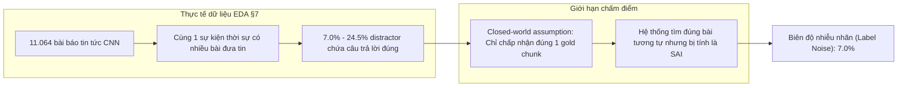
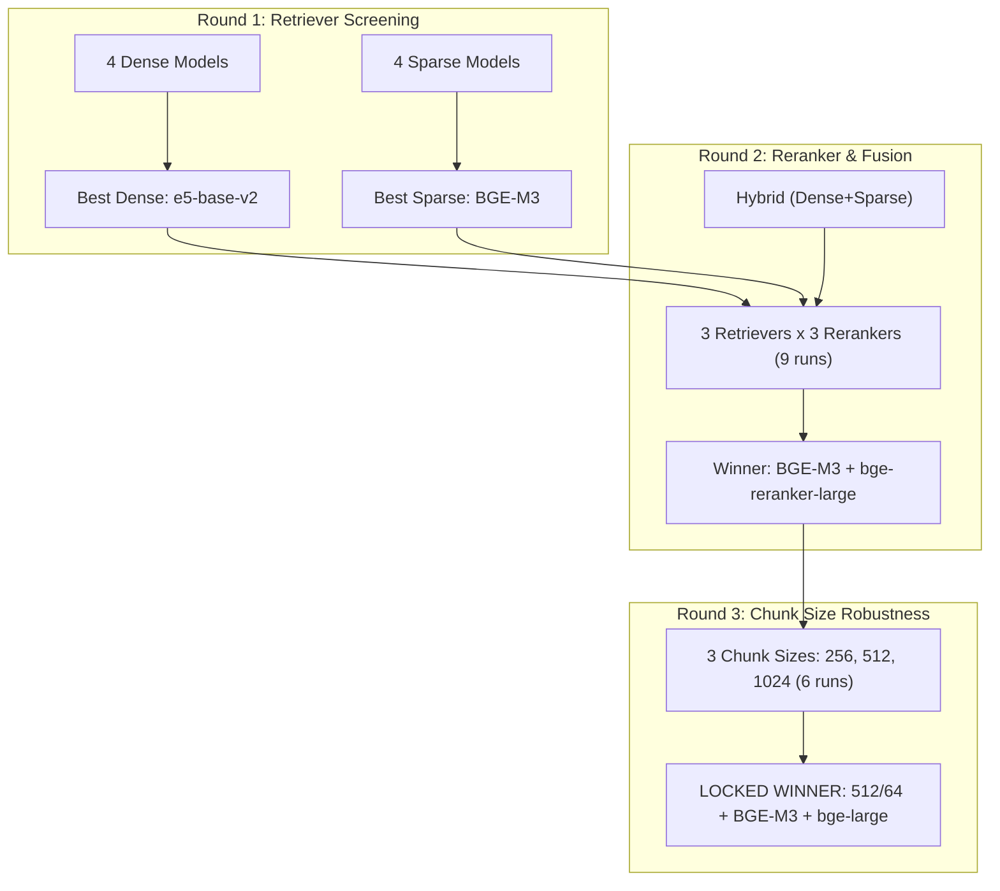

# Báo cáo Tổng hợp Thực nghiệm Phase 1: Retrieval Tournament & Phân tích Động lực Dữ liệu (EDA)

> **Dự án:** NewsQA RAG — Text Mining (HK3/Năm 3)  
> **Tập dữ liệu:** 200 bài báo NewsQA / 11.064 bài báo toàn corpus (**22.766 chunks**, `newsqa_200_11064_v2.0.0` — bản đã phục hồi phần đuôi bài báo bị cắt)  
> **Tập đánh giá phát triển:** 281 câu hỏi `resolved` (và đối chiếu 281 câu `original`) từ 50 bài báo development  
> **Nguồn kết quả thực nghiệm:** `docs/reports/phase1/round1.csv`, `docs/reports/phase1/round2.csv`, `docs/reports/phase1/round3.csv`, `docs/reports/phase1/winner_lock.jsonl`  
> **Cơ sở phân tích dữ liệu:** [docs/eda/eda_report.md](file:///D:/Coding/School/Y3-K3/Text%20Mining/Text-Mining---NewsQA-RAG/docs/eda/eda_report.md) & [docs/phase1_results.md](file:///D:/Coding/School/Y3-K3/Text%20Mining/Text-Mining---NewsQA-RAG/docs/phase1_results.md)

---

## 1. Nguyên tắc cốt lõi: Biên độ nhiễu 7.0% (The Noise Margin Rule)

Mọi so sánh và kết luận trong báo cáo này đều tuân thủ một nguyên tắc khách quan bắt nguồn từ bản chất dữ liệu:



> [!IMPORTANT]
> **Quy tắc 7.0%:** Khoảng **7.0% đến 24.5%** câu hỏi có một chunk từ bài báo khác (*distractor*) trả lời thỏa đáng câu hỏi, nhưng bộ chấm điểm đánh dấu là sai (*False Negative*). Do đó:  
> **Hai cấu hình có chênh lệch điểm số dưới 7.0% ($\Delta < 0.070$) không được xem là có sự khác biệt có ý nghĩa thực tế.** Không được đọc nhiễu đo lường thành tiến bộ kỹ thuật.

> [!NOTE]
> **Về con số 7.0% (trước đây báo cáo là 6.5%).** Bản EDA gốc đo trên kho ngữ liệu v1.0.0 (19.263 chunk). Phase 1 thực tế chạy trên **v2.0.0 đã phục hồi (22.766 chunk)**, nên toàn bộ chỉ số phụ thuộc kho ngữ liệu đã được **đo lại bằng chính script EDA cũ, chỉ đổi đường dẫn dữ liệu** (`scripts/eda/12_chunk_counts.py`; toàn bộ quy trình và bảng đối chiếu ở **Phụ lục A**). Kho lớn hơn ⇒ nhiều bài trùng sự kiện hơn ⇒ biên độ nhiễu nhích lên. Mọi con số EDA trong báo cáo này là bản v2.0.0.

### 1.1. Công cụ chính xác hơn: khoảng tin cậy 95% (CI95)

Quy tắc 7.0% ở trên là một **ngưỡng thận trọng ở mức toàn hệ thống**: nó đo tỉ lệ câu hỏi bị chấm sai oan, chứ không phải sai số của một phép so sánh cụ thể. Vì bộ chấm điểm đã xuất sẵn CI95 bootstrap cho từng cấu hình, báo cáo dùng **độ chồng lấn của hai khoảng CI95** làm căn cứ chính khi kết luận "có khác biệt hay không", và giữ quy tắc 7.0% như một lớp kiểm tra thứ hai.

| So sánh (nDCG@5, `resolved`) | Khoảng CI95 | Kết luận |
| :--- | :--- | :--- |
| BGE-M3 Sparse **vs** e5-base Dense | [0.7952, 0.8668] vs [0.6191, 0.7108] | **Tách bạch** — sparse thắng chắc chắn |
| BGE-M3 + bge-large **vs** không rerank | [0.8688, 0.9229] vs [0.7952, 0.8668] | **Tách bạch** — reranker có giá trị thật |
| Sparse + bge-large **vs** Dense + bge-large | [0.8688, 0.9229] vs [0.7736, 0.8545] | **Tách bạch** |
| BGE-M3 **vs** BM25 Okapi (stemmed) | [0.7952, 0.8668] vs [0.7772, 0.8484] | *Chồng lấn* — không tách được |
| bge-reranker-large **vs** MiniLM-L6 | [0.8688, 0.9229] vs [0.8345, 0.8929] | *Chồng lấn* — không tách được |
| Sparse **vs** Hybrid (cùng reranker) | [0.8688, 0.9229] vs [0.8032, 0.8753] | *Chồng lấn* — không tách được |
| 512/64 **vs** 256/32 **vs** 1024/128 | ba khoảng chồng lấn nhau | *Chồng lấn* — vòng 3 không có người thắng |

> **Đọc bảng này cho đúng.** Ba dòng đầu là các kết luận nhóm **được phép** phát biểu mạnh. Bốn dòng sau nhóm chỉ được phát biểu là "chọn vì lý do khác" (cơ chế dữ liệu, độ trễ, hoặc thắng trên cả hai tập câu hỏi) — **không** được nói là "tốt hơn có ý nghĩa thống kê". Ngược lại, CI95 chồng lấn **không chứng minh hai cấu hình bằng nhau**: vì mọi cấu hình chạy trên đúng cùng 281 câu hỏi, một phép kiểm định theo cặp (*paired test*) sẽ nhạy hơn so sánh hai khoảng biên. Đây là ngưỡng thận trọng, không phải kết luận vô hiệu.

Đồng thời, kết quả luôn được báo cáo theo **dải giá trị (Range Reporting)**:
* **Cận dưới (Sàn - Floor):** Tập `original` (câu hỏi gốc của NewsQA, chứa nhiều câu hỏi cụt, mơ hồ và 34 cặp câu hỏi bất khả thi).
* **Cận trên (Thực tế - Ceiling):** Tập `resolved` (câu hỏi đã được bổ sung chủ ngữ, thực thể và ngữ cảnh độc lập).

---

## 2. Thiết kế Giải đấu Phân tầng (Staged Tournament Design)

Không gian tìm kiếm đầy đủ bao gồm $8 \text{ retrievers} \times 3 \text{ rerankers} \times 3 \text{ chunk sizes} = 72 \text{ cấu hình}$. Việc chạy toàn bộ với Cross-Encoder là cực kỳ lãng phí tài nguyên và chi phí tính toán. Nhóm đã áp dụng chiến lược **giải đấu 3 vòng phân tầng**:



---

## 3. Vòng 1 — Sàng lọc Mô hình Truy xuất (Retriever Screening)

### 3.1. Bảng số liệu thực nghiệm Vòng 1 (Trích xuất từ `docs/reports/phase1/round1.csv`)

*Điều kiện kiểm soát: Cố định chunking 512/64, không sử dụng Reranker (No-op), đo trên 281 câu development.*

| Nhóm | Mô hình Truy xuất | nDCG@5 (`resolved`) | Hit@1 (`resolved`) | Hit@5 (`resolved`) | MRR@5 (`resolved`) | nDCG@5 (`original`) | P50 Latency (ms) |
| :--- | :--- | :---: | :---: | :---: | :---: | :---: | :---: |
| **Sparse** | **BAAI/bge-m3 (Learned Sparse)** | **0.8317** | **0.7260** | **0.9181** | **0.8059** | **0.4243** | 78.1 ms |
| Sparse | BM25 Okapi (stemmed) | 0.8123 | 0.6940 | 0.9146 | 0.7815 | 0.3563 | 58.6 ms |
| Sparse | BM25+ simple | 0.7206 | 0.5872 | 0.8221 | 0.6881 | 0.2436 | 101.5 ms |
| Sparse | BM25 Okapi (simple) | 0.7087 | 0.5765 | 0.8185 | 0.6733 | 0.2420 | 109.9 ms |
| **Dense** | **intfloat/e5-base-v2** | **0.6661** | **0.5267** | **0.7829** | **0.6298** | **0.2325** | 15.8 ms |
| Dense | BAAI/bge-small-en-v1.5 | 0.6472 | 0.5231 | 0.7544 | 0.6163 | 0.2285 | 16.0 ms |
| Dense | BAAI/bge-large-en-v1.5 | 0.6478 | 0.5302 | 0.7473 | 0.6199 | 0.2238 | 27.5 ms |
| Dense | sentence-transformers/all-MiniLM-L6-v2 | 0.5129 | 0.3843 | 0.6263 | 0.4815 | 0.1766 | 10.8 ms |

---

### 3.2. Động lực & Giải thích chuyên sâu từ kết quả EDA

#### A. Tại sao Sparse lại áp đảo hoàn toàn Dense?
* **Bằng chứng từ EDA §6 (đo lại trên v2.0.0):** Việc sửa chữa câu hỏi từ `original` sang `resolved` đã làm tăng mạnh lượng từ hiếm (rare terms - có $\text{IDF} \ge 6.0$, tức xuất hiện trong tối đa 55/22.766 chunk $= 0.24\%$ kho dữ liệu):
  * Số từ hiếm trung bình tăng từ **0.34 lên 0.93 từ/câu** (+169%).
  * Tỷ lệ câu hỏi có ít nhất một từ hiếm làm mỏ neo (*anchor*) tăng vọt từ **28.4% lên 59.5%**.
  * Đối chứng: cùng phép đo trên một chunk **ngẫu nhiên** chỉ cho 0.001 từ hiếm/câu — tức tín hiệu này thật, không phải hiệu ứng thống kê.
* **Cơ chế:** Các mô hình Sparse (đặc biệt là lexical và learned sparse) dựa vào các từ hiếm (tên người, địa danh, mã hiệu sự kiện) để thu hẹp phạm vi tìm kiếm cực kỳ chính xác. Mô hình Dense có xu hướng chuyển hóa câu hỏi thành vector ngữ nghĩa chung chung của toàn bộ chủ đề, dẫn đến việc bị nhiễu bởi các bài báo khác cùng lĩnh vực.
* **Chứng minh tính bền vững:** EDA từng cảnh báo: *"Nếu chỉ đo trên tập resolved, sparse sẽ được ưu ái không công bằng"*. Tuy nhiên, khi nhìn vào cột `original` (nơi câu hỏi chưa được làm rõ từ hiếm), **BGE-M3 Sparse vẫn đánh bại e5-base Dense tới 0.1918 nDCG@5** (0.4243 vs 0.2325). Khoảng cách này gấp **2.7 lần** biên độ nhiễu 7.0%, và trên tập `resolved` hai khoảng CI95 **hoàn toàn không chồng lấn** ([0.7952, 0.8668] vs [0.6191, 0.7108]). Đây là kết luận duy nhất trong Vòng 1 được phát biểu ở mức mạnh — và nó vượt qua được chính cái thiên vị mà EDA đã cảnh báo.

#### B. Tại sao BGE-M3 vượt trội hơn BM25 truyền thống?
> [!WARNING]
> **Đây là lựa chọn nhóm KHÔNG chứng minh được bằng thống kê, và báo cáo nói thẳng điều đó.**

* Trên tập `resolved`, BGE-M3 chỉ hơn BM25-stemmed $\Delta \text{nDCG@5} = 0.8317 - 0.8123 = 0.0194$, và hai khoảng CI95 chồng lấn gần như hoàn toàn ([0.7952, 0.8668] vs [0.7772, 0.8484]).
* Trên tập `original`, khoảng cách rộng hơn — **0.0680** (0.4243 vs 0.3563) — nhưng vẫn **nằm ngay dưới ngưỡng nhiễu 7.0%**. Bằng chứng đo lường **không đủ** để tuyên bố BGE-M3 tốt hơn BM25-stemmed.
* **Vậy tại sao vẫn chọn BGE-M3?** Ba lý do, không lý do nào là "điểm cao hơn":
  1. **Cơ chế dữ liệu (EDA §7):** có **35.2% câu hỏi (470/1.336) không chứa bất kỳ từ hiếm nào** (chỉ gồm từ phổ biến như *"who was found dead"*, *"where did the accident happen"*). Ở nhóm này BM25 thuần từ vựng không có từ neo để bám. BGE-M3 dùng trọng số nơ-ron học được (*learned lexical weights*) và mở rộng từ vựng tự động, nên suy thoái mượt mà hơn (*degrade gracefully*).
  2. **Thắng trên cả hai tập câu hỏi**, không phụ thuộc vào tập nào được chọn để báo cáo.
  3. **Nhất quán với Phase 2:** BGE-M3 là mô hình đã được khóa trong artifact `bge_m3_sparse.pkl`; đổi sang BM25 lúc này đồng nghĩa dựng lại toàn bộ chỉ mục mà không có bằng chứng nào cho thấy sẽ tốt hơn.
* **Phát biểu trung thực:** *"BM25-stemmed là đối thủ ngang tài trên corpus này. Nhóm chọn BGE-M3 vì cơ chế xử lý nhóm câu hỏi không có từ hiếm, chứ không phải vì nó ghi điểm cao hơn một cách có ý nghĩa."*

#### C. Bài học sửa sai về lựa chọn Best Dense (The Noise Rule in Action)
* Trong lần chạy ban đầu, nhóm từng chọn `bge-small` làm đại diện Dense vì trên tập `original` nó đạt 0.2285 so với `e5-base` đạt 0.2325 (chênh lệch chỉ **0.004** — hoàn toàn là nhiễu).
* Khi chuẩn hóa giao thức chuyển sang đánh giá trên `resolved`, `e5-base-v2` dẫn trước `bge-small` tới **+0.0189 nDCG@5** và **+2.85% Hit@5** (0.7829 vs 0.7544), đồng thời độ trễ tương đương (15.8ms vs 16.0ms). Do đó, `e5-base-v2` mới là lựa chọn Dense có căn cứ khoa học vững chắc.

---

## 4. Vòng 2 — Đánh giá Reranker & Thử nghiệm Dung hợp Hybrid

Vòng 2 đánh giá sự tương tác giữa 3 bộ truy xuất (Best Sparse, Best Dense, Hybrid 70/30) với 3 mức độ Rerank: **No-op** (không rerank), **MiniLM-L-6-v2** (Cross-encoder nhỏ 22M), và **BGE-Reranker-Large** (Cross-encoder lớn 560M).

### 4.1. Bảng số liệu ma trận $3 \times 3$ Vòng 2 (Trích xuất từ `docs/reports/phase1/round2.csv`)

#### A. Trên tập `resolved` (Kịch bản thực tế):

| Bộ Truy xuất (Candidate Pool = 20) | Reranker Model | nDCG@5 | Hit@1 | Hit@5 | MRR@5 | $\Delta \text{Hit@1}$ | P50 Total Latency |
| :--- | :--- | :---: | :---: | :---: | :---: | :---: | :---: |
| **Sparse (BGE-M3)** | **BAAI/bge-reranker-large** | **0.8976** | **0.8221** | **0.9573** | **0.8797** | **+0.0961** | **510.1 ms** |
| Sparse (BGE-M3) | ms-marco-MiniLM-L-6-v2 | 0.8642 | 0.7580 | 0.9502 | 0.8387 | +0.0320 | 163.9 ms |
| Sparse (BGE-M3) | No-op (Không rerank) | 0.8317 | 0.7260 | 0.9181 | 0.8059 | — | 66.1 ms |
| **Hybrid (Dense 70% + Sparse 30%)** | BAAI/bge-reranker-large | 0.8405 | 0.7580 | 0.9075 | 0.8203 | +0.1246 | 609.8 ms |
| Hybrid | ms-marco-MiniLM-L-6-v2 | 0.8164 | 0.7189 | 0.8968 | 0.7938 | +0.0854 | 193.3 ms |
| Hybrid | No-op (Không rerank) | 0.7474 | 0.6335 | 0.8399 | 0.7192 | — | 90.4 ms |
| **Dense (e5-base-v2)** | BAAI/bge-reranker-large | 0.8172 | 0.7402 | 0.8754 | 0.7997 | +0.2135 | 540.5 ms |
| Dense | ms-marco-MiniLM-L-6-v2 | 0.7994 | 0.7082 | 0.8719 | 0.7783 | +0.1815 | 127.3 ms |
| Dense | No-op (Không rerank) | 0.6684 | 0.5267 | 0.7865 | 0.6316 | — | 17.7 ms |

#### B. Trên tập `original` (Cận dưới):

| Bộ Truy xuất | Reranker Model | nDCG@5 | Hit@1 | Hit@5 | MRR@5 | P50 Total Latency |
| :--- | :--- | :---: | :---: | :---: | :---: | :---: |
| **Sparse (BGE-M3)** | **BAAI/bge-reranker-large** | **0.4824** | **0.4093** | **0.5445** | **0.4651** | 505.7 ms |
| Sparse (BGE-M3) | ms-marco-MiniLM-L-6-v2 | 0.4400 | 0.3381 | 0.5267 | 0.4144 | 155.9 ms |
| Sparse (BGE-M3) | No-op | 0.4243 | 0.3345 | 0.5053 | 0.4013 | 61.0 ms |
| **Hybrid** | BAAI/bge-reranker-large | 0.3607 | 0.2883 | 0.4306 | 0.3400 | 610.3 ms |
| **Dense** | BAAI/bge-reranker-large | 0.3332 | 0.2633 | 0.4021 | 0.3146 | 541.8 ms |

---

### 4.2. Động lực & Lý giải từ EDA

#### A. Tại sao Reranker được chứng minh cần thiết từ trước khi chạy thực nghiệm?
* **Phát hiện từ EDA §7 về độ cạnh tranh của các chunk (Competitor Analysis — đo lại trên v2.0.0):**
  * Trong toàn bộ 22.766 chunks, việc lọc bằng từ hiếm rút gọn số ứng viên xuống giá trị trung vị (*median*) là **25 chunks**.
  * Tuy nhiên, chỉ có **25.8% câu hỏi** thu hẹp được xuống $\le 10$ chunks; ở phân vị 90th percentile vẫn còn **61 chunks đối thủ**, trường hợp xấu nhất là 193.
* **Nhận định mang tính quyết định:**
  > *"Rút từ 22.766 xuống 25 chunks là bước tiến khổng lồ, nhưng 25 không phải là 1. Truy xuất chặng 1 (first-stage retrieval) đưa ta đến rất gần mục tiêu nhưng không thể hoàn thành nhiệm vụ."*
* Số liệu thực nghiệm đã xác nhận hoàn toàn dự đoán từ EDA:
  * Khi đưa vào `bge-reranker-large`, điểm **Hit@1 tăng vọt từ 0.7260 lên 0.8221 (+9.61%)** — gấp **1.4 lần** biên độ nhiễu 7.0%, và là **một trong ba kết luận có CI95 tách bạch** ([0.8688, 0.9229] vs [0.7952, 0.8668]). Reranker mang lại giá trị thật, không phải ngẫu nhiên.
  * Tỷ lệ tìm thấy chunk đúng trong top 5 (`Hit@5`) đạt tới **95.73%**.
* **Lưu ý:** so với v1.0.0, kho phục hồi làm bài toán **khó hơn** (trung vị đối thủ 20 → 25; tỉ lệ thu hẹp được xuống ≤10 giảm 30.7% → 25.8%). Lập luận "cần reranker" vì thế mạnh hơn chứ không yếu đi.

#### B. Phát hiện phủ định mang giá trị học thuật cao: Tại sao Hybrid lại thất bại?
* Thử nghiệm dung hợp Hybrid (Dense + Sparse bằng RRF) làm **tụt giảm 0.0571 nDCG@5** so với việc dùng Sparse thuần túy (0.8405 vs 0.8976 khi cùng dùng BGE-Reranker-Large). Khoảng cách này **dưới ngưỡng nhiễu 7.0% và hai CI95 chồng lấn** ([0.8688, 0.9229] vs [0.8032, 0.8753]) — nên phát biểu đúng là *"Hybrid không mang lại lợi ích nào đo được"*, chứ không phải *"Hybrid tệ hơn hẳn"*.
* **Lý giải cơ chế:**
  * Trên tập `resolved`, Sparse có tín hiệu neo từ vựng cực kỳ mạnh trên 59.5% câu hỏi.
  * Khi thực hiện Reciprocal Rank Fusion, việc cộng gộp danh sách xếp hạng từ Dense (vốn có độ chính xác thấp hơn nhiều: 0.6684 vs 0.8317) đã vô tình **pha loãng tín hiệu chính xác của Sparse bằng tín hiệu nhiễu của Dense**.
  * Đóng góp tích cực của Dense chỉ xuất hiện ở 35.2% câu hỏi không có từ hiếm, nhưng nhóm này không đủ lớn để bù đắp cho thiệt hại do pha loãng gây ra ở 64.8% còn lại.
  * Bằng chứng ủng hộ cơ chế này: Hybrid **thua ở mọi mức reranker** (không rerank 0.7474 vs 0.8317; MiniLM 0.8164 vs 0.8642; bge-large 0.8405 vs 0.8976) — thiệt hại xuất hiện ngay từ chặng 1, đúng chỗ RRF hoạt động, chứ không phải do reranker.
* **Quyết định kiến trúc:** Nhóm lưu giữ đây là một kết quả phủ định (*documented negative result*) có giá trị bảo vệ khoa học cao, giải thích lý do hệ thống chuyển thành kiến trúc **Single-Retriever (Sparse Only)** thay vì cố đấm ăn xôi dùng Hybrid.

#### C. Đánh đổi về Độ trễ (Latency vs Quality Trade-off)
* `bge-reranker-large` tốn **510 ms P50** (gấp ~3.1 lần so với `ms-marco-MiniLM-L-6-v2` chỉ tốn 164 ms).
* Tuy nhiên, nó mang lại thêm **+0.0334 nDCG@5** và đặc biệt là **+6.41% Hit@1** (0.8221 vs 0.7580). Cả hai đều **dưới ngưỡng nhiễu 7.0%, và hai CI95 chồng lấn** ([0.8688, 0.9229] vs [0.8345, 0.8929]).
* **Quyết định:** Theo tiêu chí *Quality-First* đã đăng ký trước (tie-break: chất lượng trước, độ trễ sau), nhóm chọn `bge-reranker-large` làm cấu hình khóa — nhưng ghi nhận rõ rằng **bằng chứng không tách bạch được hai reranker**. `MiniLM-L6` do đó không chỉ là phương án dự phòng: nếu ràng buộc triển khai là độ trễ, nó là lựa chọn **hợp lý ngang bằng** với chi phí chỉ bằng 1/3.

---

## 5. Vòng 3 — Kiểm chứng Kích thước Đoạn cắt (Chunk Size Robustness)

Vòng 3 kiểm tra tính bền vững của Quán quân Vòng 2 trên 3 kích thước chunk: **256/32**, **512/64**, và **1024/128** tokens (tỷ lệ overlap chuẩn 12.5%).

### 5.1. Bảng số liệu thực nghiệm Vòng 3 (Trích xuất từ `docs/reports/phase1/round3.csv`)

*Cấu hình: BGE-M3 Sparse + BGE-Reranker-Large, top 5 sau rerank.*

| Kích thước Chunk (Tokens / Overlap) | nDCG@5 (`resolved`) | Hit@1 (`resolved`) | Hit@5 (`resolved`) | MRR@5 (`resolved`) | nDCG@5 (`original`) | P50 Rerank Latency |
| :--- | :---: | :---: | :---: | :---: | :---: | :---: |
| **512 / 64 (Mặc định)** | **0.8976** | **0.8221** | **0.9573** | **0.8797** | **0.4824** | **442.3 ms** |
| 1024 / 128 (Lớn) | 0.8862 | 0.8363 | 0.9253 | 0.8747 | 0.4882 | 454.3 ms |
| 256 / 32 (Nhỏ) | 0.8507 | 0.7438 | 0.9395 | 0.8224 | 0.4380 | 232.0 ms |

---

### 5.2. Động lực & Lý giải trung thực từ EDA

#### Nhận định khoa học thẳng thắn: Vòng đấu không có người thắng áp đảo
* Khoảng cách giữa cấu hình cao nhất (512/64: 0.8976) và thấp nhất (256/32: 0.8507) là **0.0469 — hoàn toàn nằm dưới biên độ nhiễu 7.0%**, và **cả ba khoảng CI95 đều chồng lấn nhau** ([0.8688, 0.9229] / [0.8528, 0.9172] / [0.8189, 0.8830]). Không có cơ sở thống kê để xếp hạng ba cấu hình này.
* **Lý giải từ EDA §1 — đo lại trên kho ngữ liệu v2.0.0 đã phục hồi:** Phân bố độ dài bài báo NewsQA cho thấy một đặc tính mấu chốt. Số liệu dưới đây là của kho ngữ liệu mà Phase 1 **thực sự chạy trên đó** (`newsqa_200_11064_v2.0.0`, sau khi đã nối lại phần đuôi bị cắt cho 4.603 bài):

  | | v1.0.0 (kho EDA đo ban đầu) | **v2.0.0 (Phase 1 chạy trên đây)** |
  |---|---|---|
  | tổng số chunk | 19.263 | **22.766** |
  | trung bình chunk/bài | 1,74 | **2,06** |
  | trung vị token/bài | 720 | **724** |
  | phân bố (1 / 2 / 3 / 4+ chunk) | 2.971 / 7.987 / 106 / 0 | **2.939 / 5.456 / 1.934 / 735** |
  | nhiều chunk nhất | 3 | **7** |

  Phục hồi đã nối thêm 5,35 triệu ký tự vào 41,6% số bài, nên số chunk tăng 18,2%. Nhưng **trung vị không đổi** (720 → 724 token): phục hồi chỉ chạm tới một phần kho, còn **75,9% số bài vẫn chỉ có tối đa 2 chunk**.

* **Kết luận:**
  > *"Với ba phần tư kho ngữ liệu, bài toán tìm đúng chunk gần như đồng nhất với bài toán tìm đúng bài báo. Dư địa để chiến lược chunking tạo đột biến là rất hẹp."*

  Điều đáng nói là **việc phục hồi đã mở ra dư địa đó**: trước phục hồi chỉ 106 bài (0,96%) tách thành 3 chunk trở lên, sau phục hồi là 2.669 bài (24,1%). Vậy mà chênh lệch giữa ba cấu hình chunk vẫn chỉ 0,0469 — dưới ngưỡng nhiễu. Kết quả "chunk size không quan trọng" vì thế **mạnh hơn**, chứ không yếu đi: nó đứng vững ngay cả khi đã có chỗ cho nó thay đổi.
* **Lý do chọn 512/64:** Không tuyên bố "512/64 là tối ưu tuyệt đối" — bằng chứng đo lường không cho phép nói vậy. 512/64 được chọn vì:
  1. Đạt điểm số cao nhất trong các cấu hình thử nghiệm (dù khoảng cách nằm trong nhiễu);
  2. Kích thước 512 tokens là điểm cân bằng cho LLM ở Phase 2: không quá ngắn khiến câu trả lời bị cắt đôi sang chunk khác (như 256), cũng không quá dài gây loãng thông tin và tăng chi phí token context (như 1024);
  3. Là kích thước mặc định đã dùng xuyên suốt Vòng 1 và Vòng 2 — giữ nguyên nó đồng nghĩa **không có biến số nào thay đổi ngoài dự kiến** giữa các vòng.

---

## 6. Cấu hình Khóa Chính thức (The Locked Configuration)

Cấu hình chiến thắng tuyệt đối được cố định tại `docs/reports/phase1/winner_lock.jsonl` và dùng làm nền tảng cho toàn bộ Phase 2:

```yaml
# Cấu hình Retrieval Pipeline đã khóa (Locked Configuration)
retrieval:
  retriever: "sparse"
  sparse:
    method: "bge-m3"
    model: "BAAI/bge-m3"
  top_k: 20
  reranker:
    enabled: true
    type: "cross-encoder"
    model: "BAAI/bge-reranker-large"
    top_n: 5
    batch_size: 8
chunking:
  strategy: "recursive"
  chunk_size: 512
  chunk_overlap: 64
```

### Bảng tổng kết hiệu năng toàn diện của Cấu hình Khóa:

| Nhóm Chỉ số | Metric | Giá trị (`resolved`) | Giá trị (`original`) | Ghi chú & Ý nghĩa |
| :--- | :--- | :---: | :---: | :--- |
| **Xếp hạng hàng đầu** | **Hit@1** | **82.21%** | 40.93% | Khả năng đưa đúng chunk chứa đáp án lên vị trí đầu tiên |
| **Độ phủ Top 5** | **Hit@5** | **95.73%** | 54.45% | Tỷ lệ context top 5 cung cấp cho LLM chứa bằng chứng |
| **Chất lượng truy xuất** | **nDCG@5** | **0.8976** | 0.4824 | Điểm đánh giá toàn diện vị trí xuất hiện của gold chunks |
| **Thứ hạng nghịch đảo** | **MRR@5** | **0.8797** | 0.4651 | Điểm thưởng cho việc đưa chunk đúng lên các thứ hạng cao |
| **Độ phủ bằng chứng** | **Recall@5** | **95.55%** | 54.09% | Tỷ lệ span evidence được bao phủ bởi top 5 chunks |
| **Độ trễ (Latency)** | **Retrieve P50** | **66.1 ms** | 61.0 ms | Thời gian trích xuất 20 ứng viên từ chỉ mục BGE-M3 |
| | **Rerank P50** | **444.8 ms** | 445.3 ms | Thời gian Cross-Encoder chấm điểm và lọc top 5 |
| | **Total P50** | **510.1 ms** | 505.7 ms | Tổng thời gian truy xuất hoàn chỉnh cho một câu hỏi |

---

## 7. Bảng so sánh tiến trình nâng cấp qua từng giai đoạn

Dưới đây là hành trình cải tiến rõ rệt từ mốc cơ sở (Baseline cũ) đến Cấu hình Khóa cuối cùng:

*Mọi dòng dưới đây là **cấu hình đã thực sự chạy và có trong CSV** — không có dòng nào là ước lượng.*

| Giai đoạn Pipeline | Cấu hình Chi tiết | Hit@1 | Hit@5 | nDCG@5 | MRR@5 | Total Latency (P50) |
| :--- | :--- | :---: | :---: | :---: | :---: | :---: |
| **0. Điểm xuất phát yếu nhất** | all-MiniLM-L6-v2 Dense thuần (No Rerank) — cấu hình kém nhất Vòng 1 | 0.3843 | 0.6263 | 0.5129 | 0.4815 | 10.8 ms |
| **1. Sau Vòng 1** | BGE-M3 Sparse thuần (No Rerank) | 0.7260 | 0.9181 | 0.8317 | 0.8059 | 78.1 ms |
| **2. Sau Vòng 2** | BGE-M3 Sparse + MiniLM-L6 Reranker | 0.7580 | 0.9502 | 0.8642 | 0.8387 | 163.9 ms |
| **3. Cấu hình Khóa (Vòng 3)** | **BGE-M3 Sparse + BGE-Reranker-Large (Chunk 512/64)** | **0.8221** | **0.9573** | **0.8976** | **0.8797** | **510.1 ms** |
| **Mức tăng tổng thể ($\Delta$)** | *So với dòng 0* | **+0.4378** | **+0.3310** | **+0.3847** | **+0.3982** | *Đánh đổi +499 ms* |

> [!NOTE]
> Dòng 0 **không phải là "baseline hệ thống cũ"** — nhóm chưa từng chạy một pipeline hybrid MiniLM+BM25 hoàn chỉnh, nên không có số thật cho cấu hình đó và báo cáo không bịa ra. Dòng 0 ở đây là **cấu hình có điểm thấp nhất trong 23 cấu hình đã thử**, dùng làm mốc so sánh trung thực: nó cho thấy khoảng cách giữa lựa chọn tệ nhất và lựa chọn cuối cùng trong cùng một không gian thiết kế.
>
> Đọc bảng theo chiều dọc cũng cho thấy **phần lớn lợi ích đến từ Vòng 1** (chọn đúng bộ truy xuất: +0.32 nDCG@5), phần còn lại từ reranker (+0.066). Đây là thứ tự ưu tiên đáng nhớ khi tối ưu một hệ RAG: **chọn đúng retriever trước, tinh chỉnh sau.**

---

## 8. Các hàm ý dữ liệu quan trọng đối với Phase 2 (Generation)

1. **Hiện tượng Truncation (EDA §3 & §4):**
   * 41.6% bài báo trong kho dữ liệu bị cắt ngắn ở ngưỡng 640 - 680 từ (do lỗi từ tập NewsQA gốc). **Toàn bộ 4.603 bài này đã được phục hồi** bằng `scripts/restore_corpus.py` từ các trang lưu trữ trong `data/cnn_downloads.tgz` — đây chính là kho v2.0.0 mà Phase 1 chạy trên đó.
   * Phục hồi là thao tác **chỉ nối thêm vào cuối** (*append-only*): mọi offset ký tự của evidence span giữ nguyên, nên không cần ánh xạ lại ground truth. Hệ quả logic: bài dài ra trong khi đáp án đứng yên ⇒ đáp án chỉ có thể nằm **sớm hơn** theo tỉ lệ, không bao giờ muộn hơn.
   * Đo lại vị trí bằng chứng (tỉ lệ offset/độ dài bài): trung vị **16.5% → 16.0%**, số span rơi vào 10% cuối bài **27 → 21**. Đáp án NewsQA nằm ở phần đầu bài báo, đúng chỗ truncation không chạm tới — nên truncation không gây tổn hại đáng kể cho giai đoạn sinh của LLM.
2. **Loại bỏ hiện tượng đánh giá thiên vị (Self-grading Bias):**
   * EDA §9 phát hiện một lỗi nghiêm trọng trong notebook cũ khi đặt `JUDGE_MODEL = GENERATOR_MODEL`. Điều này khiến LLM tự chấm điểm bài làm của chính nó.
   * Sang Phase 2, cấu hình đánh giá đã được tách biệt độc lập: Generator là `gemini-3.1-flash-lite` (hoặc `gpt-4o-mini`), trong khi Judge là `glm-5.3-flash` chạy trên endpoint Fireworks AI riêng biệt.
3. **Hiện tượng câu hỏi trùng ngữ nghĩa (hai hiện tượng khác nhau, đừng gộp):**
   * **Tác dụng phụ của việc làm rõ câu hỏi (EDA §6):** 47 nhóm câu hỏi vốn khác nhau đã trở thành **giống hệt nhau từng chữ** sau khi bổ sung ngữ cảnh — 96 câu (7.2%), tương đương **49 câu bị hỏi trùng**. Cả 47 nhóm đều nằm trong cùng một bài báo và cùng gold chunk, nên không câu nào trở nên bất khả thi; nhưng 47 bài báo đó bị **tính trọng số gấp đôi** trong điểm số.
   * **Khử trùng lặp ngữ nghĩa (bước riêng, chạy sau):** LLM đề xuất + người duyệt đã gom **155 cụm gồm 339 câu** cùng hỏi một sự kiện trong cùng bài báo, giữ lại 1 câu đại diện mỗi cụm ⇒ **loại 184 câu**, đưa 1.336 → **1.152 câu hỏi độc lập ngữ nghĩa**.
   * Toàn bộ đánh giá của Phase 2 được xây dựng trên tập semantic-deduplicated này. Phase 1 cũng đã chạy trên tập này (281 câu development từ 50 bài).

---

## Phụ lục A. Cách các con số EDA trong báo cáo này được đo lại

Bản EDA gốc (`docs/eda/eda_report.md`) chạy trên kho ngữ liệu **v1.0.0**, trước khi `scripts/restore_corpus.py` nối lại phần đuôi bị cắt cho 4.603 bài. Nhưng Phase 1 chạy trên **v2.0.0** (notebook 06 ghim commit Hugging Face `b81c8db…`). Vì vậy mọi chỉ số EDA phụ thuộc kho ngữ liệu đã được đo lại.

**Nguyên tắc:** dùng **đúng script EDA cũ, đúng tham số cũ** (`RARE_IDF = 6.0`, cùng danh sách stopword, cùng cách cắt chunk 512/64), chỉ đổi đường dẫn dữ liệu. Mọi khác biệt trong kết quả vì thế là khác biệt của **dữ liệu**, không phải của **phương pháp**.

**Kiểm chứng phương pháp:** trước khi báo cáo số v2.0.0, quy trình được chạy lại trên v1.0.0 và phải tái tạo **chính xác** các con số EDA đã công bố — 19.263 chunk, 1,74 chunk/bài, phân bố {1: 2.971, 2: 7.987, 3: 106}. Nó tái tạo đúng cả ba. Chỉ sau đó số v2.0.0 mới được chấp nhận.

| Chỉ số | v1.0.0 (EDA gốc) | **v2.0.0 (báo cáo này)** | Ảnh hưởng đến kết luận |
| :--- | :---: | :---: | :--- |
| Tổng số chunk | 19.263 | **22.766** | — |
| Chunk/bài (trung bình) | 1,74 | **2,06** | Vòng 3: dư địa rộng hơn, kết quả null **mạnh hơn** |
| Bài có ≥3 chunk | 106 (0,96%) | **2.669 (24,1%)** | như trên |
| Ngưỡng từ hiếm (IDF ≥ 6.0) | ≤46/19.263 chunk | **≤55/22.766 chunk** | tỉ lệ không đổi (0,24%) |
| Từ hiếm/câu — `original` → `resolved` | 0,33 → 0,89 | **0,34 → 0,93** | §3.2A: không đổi kết luận |
| Câu có ≥1 mỏ neo — `original` → `resolved` | 27,7% → 57,7% | **28,4% → 59,5%** | như trên |
| Câu **không** có từ hiếm nào | 493 (37%) | **470 (35,2%)** | §3.2B, §4.2B: không đổi kết luận |
| Số chunk đối thủ (trung vị) | 20 | **25** | §4.2A: lập luận cần reranker **mạnh hơn** |
| Thu hẹp được xuống ≤10 đối thủ | 30,7% | **25,8%** | như trên |
| Biên độ nhiễu nhãn (≥2 từ hiếm chung) | 6,5% | **7,0%** | §1: ngưỡng nâng lên, §3.2B đổi kết luận |
| Cận trên (khớp chuỗi bất kỳ) | 23,1% | **24,5%** | — |

**Một kết luận đã thay đổi vì việc đo lại này.** Khoảng cách BGE-M3 vs BM25-stemmed trên tập `original` là 0,0680 — trước đây vượt ngưỡng 6,5%, nay **nằm dưới ngưỡng 7,0%**. Báo cáo đã sửa §3.2B: lựa chọn BGE-M3 nay được biện minh bằng cơ chế dữ liệu, không phải bằng ưu thế điểm số. Đây là hướng sửa **bất lợi** cho lập luận của nhóm, và vẫn được ghi lại đầy đủ.

**Tái lập:** `scripts/eda/12_chunk_counts.py` in ra bảng chunk cho cả hai phiên bản kho ngữ liệu. Các chỉ số từ hiếm và đối thủ được tạo bằng cách chạy `scripts/eda/03_lexical_overlap.py` và `04_distractor_collision.py` với `common.FINAL` trỏ vào bản v2.0.0 đã materialize từ `data/evaluation/newsqa_200_11064_restored/`.
