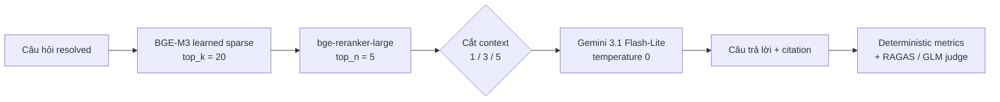

# Báo cáo Tổng hợp Phase 1 + Phase 2 — Hệ thống NewsQA RAG

> **Dự án:** NewsQA RAG — Text Mining (HK3/Năm 3)
> **Kho ngữ liệu:** `MatchaMacchiato/newsqa_200_11064_v2.0.0` — 11.064 bài báo, **22.766 chunks** (bản đã phục hồi phần đuôi bị cắt)
> **Tập đánh giá:** 1.152 câu hỏi `resolved` đã khử trùng lặp ngữ nghĩa và có người duyệt, chia theo bài báo
> **Báo cáo chi tiết từng phase:** [Phase 1 — Retrieval Tournament](phase1/report.md) · [Phase 1 (bản tiếng Anh, gọn)](../phase1_results.md) · [EDA](../eda/eda_report.md)
> **Nguồn số liệu:** `docs/reports/phase1/{round1,round2,round3}.csv`, `winner_lock.jsonl`, `paired_significance.json` và artifact Phase 2 trên Kaggle/Colab

---

## 0. Trạng thái một trang

| Giai đoạn | Nội dung | Trạng thái | Kết quả chốt |
| :--- | :--- | :--- | :--- |
| **EDA** | Khảo sát dữ liệu, phát hiện truncation & nhiễu nhãn | ✅ Xong | Ngưỡng nhiễu **7,0%–24,5%**; phục hồi 4.603 bài |
| **Phase 1** | Giải đấu 23 cấu hình truy xuất, 3 vòng | ✅ **Đã khóa** | BGE-M3 sparse → bge-reranker-large → top 5, chunk 512/64 |
| **Phase 2A** | Baseline end-to-end trên 281 câu development | ✅ Xong | Answer Correctness **0,6308** |
| **Phase 2B.1** | Sàng lọc 4 prompt (P0–P3) | ✅ Xong | **P2** là prompt duy nhất qua guardrail |
| **Phase 2B.2** | Sàng lọc độ sâu context (1/3/5) | ✅ Xong | Hai finalist: P2-depth3, P2-depth5 |
| **Phase 2B.3** | Xác nhận finalist trên đủ 281 câu | ⏳ Đang chạy | P2-depth3 xong; **P2-depth5 chưa xong** |
| **Phase 2B.4** | Held-out 284 câu, chạy đúng một lần | ⛔ Chưa chạy | *chưa được phép chạm vào* |
| **Phase 3** | Abstention / từ chối trả lời | ⛔ Bị chặn | chờ duyệt tay 35 ca pilot |

> [!IMPORTANT]
> **Chưa có winner Phase 2.** Theo bộ guardrail đã đăng ký trước khi xem kết quả, **P2-depth3 đã trượt 2 trong 4 điều kiện** (§5.5). Nghĩa là quyết định cuối cùng phụ thuộc hoàn toàn vào P2-depth5. Không được nới ngưỡng sau khi đã nhìn thấy số.

---

## 1. Pipeline end-to-end hiện tại



| Thành phần | Cấu hình | Nguồn quyết định | Còn được đổi không? |
| :--- | :--- | :--- | :--- |
| Chunking | Recursive, 512 / overlap 64 | Phase 1 vòng 3 | **Không** — đã khóa |
| Retriever | BGE-M3 learned sparse, top 20 | Phase 1 vòng 1 | **Không** — đã khóa |
| Reranker | `BAAI/bge-reranker-large`, top 5 | Phase 1 vòng 2 | **Không** — đã khóa |
| Prompt | P0 (control) / **P2** (ứng viên) | Phase 2B.1 | Đang tinh chỉnh |
| Context depth | 1 / 3 / **5** | Phase 2B.2–2B.3 | Đang tinh chỉnh |
| Generator | `gemini-3.1-flash-lite`, temp 0, minimal reasoning | — | Không tinh chỉnh trọng số |
| Judge | `glm-5p3-flash` (Fireworks), low reasoning | EDA §9 | **Bắt buộc tách khỏi generator** |
| Seed | 42 | — | — |

> [!NOTE]
> **Phase 2 không huấn luyện lại gì cả.** Nó chỉ đổi hai biến: nội dung prompt và số context đưa vào. Retrieval + rerank chạy **đúng một lần**, mọi thí nghiệm depth chỉ cắt ngắn danh sách đã rerank sẵn. Nhờ vậy mọi khác biệt đo được quy hết cho generation, không lẫn dao động truy xuất.

---

## 2. Hai bộ quy tắc phán quyết, và vì sao chúng phải khác nhau

Đây là chỗ dễ đọc nhầm nhất khi ghép hai phase, nên nói rõ ngay.

| | **Phase 1 (truy xuất)** | **Phase 2 (sinh)** |
| :--- | :--- | :--- |
| Metric chính | nDCG@5 | RAGAS Answer Correctness |
| Cách phán quyết | CI95 của **hiệu theo từng câu** không chứa 0 | Qua đủ **4 guardrail**, rồi mới so metric chính |
| Ràng buộc thực tiễn | Chênh < 0,070 = nằm trong nhiễu nhãn | Coverage ≥ 95%; Faithfulness không giảm quá 0,02; Citation F1 và Citation Validity không giảm quá 0,01 |
| Chi phí một lần chạy | GPU, không tốn tiền API | Tốn tiền API, có rủi ro sinh sai |
| Vì sao khác | Sai một chút chỉ là xếp hạng kém | Sai một chút là **hệ thống nói điều không có trong bằng chứng** |

Phase 1 hỏi *"cái nào tốt hơn?"*. Phase 2 hỏi *"cái nào tốt hơn **mà không đánh đổi tính trung thực**?"* — nên nó cần guardrail chứ không chỉ cần một điểm số cao hơn.

**Điểm chung của cả hai:** so sánh luôn **theo cặp trên cùng bộ câu hỏi**, bootstrap gom cụm theo bài báo. Lý do đã trình bày kỹ ở [Phase 1 §1.2](phase1/report.md): độ khó của từng câu hỏi là nguồn nhiễu **dùng chung**, và nó tự triệt tiêu khi lấy hiệu trước rồi mới tổng hợp. Khoảng CI biên (tính riêng từng cấu hình) quá rộng, không bao giờ phát hiện được chênh lệch thật cỡ 0,02.

> [!WARNING]
> Ngưỡng nhiễu 7,0% và guardrail Phase 2 là **hai loại ràng buộc khác nhau**, đừng gộp. 7,0% nói về *ý nghĩa thực tiễn* (chênh nhỏ hơn thế thì không đáng tin, vì bộ chấm có sai sót hệ thống). Guardrail nói về *điều không được phép đánh đổi*. Một cấu hình có thể vượt ngưỡng nhiễu mà vẫn bị loại vì guardrail — và đó chính là chuyện đang xảy ra với P2-depth3.

---

## 3. Dữ liệu: một tập, ba lần chia

| Phần | Số bài | Số câu | Dùng để làm gì | Đã chạm chưa |
| :--- | ---: | ---: | :--- | :--- |
| Development | 50 | **281** | Baseline, sàng lọc, chọn winner | Đã chạm nhiều lần |
| Held-out final | 50 | 284 | Đánh giá winner **đúng một lần** | Chưa |
| Held-out reserve | 100 | 587 | Nghiên cứu mở rộng | Chưa |
| **Tổng** | **200** | **1.152** | | |

- Chia theo `article_key`, **không** chia ngẫu nhiên từng câu — nên không có câu hỏi nào của cùng một bài báo xuất hiện ở cả hai bên.
- Tập `resolved` là tập báo cáo chính; `original` dùng làm **cận dưới** (nhiều câu cụt, mơ hồ).
- 1.336 → 1.152 câu sau khi khử trùng lặp ngữ nghĩa (155 cụm gồm 339 câu, giữ 1 đại diện mỗi cụm, có người duyệt).
- Full set 1.336 câu chỉ dành cho sensitivity analysis, **không** dùng chọn winner.

> [!IMPORTANT]
> Mọi con số trong báo cáo này, cả Phase 1 lẫn Phase 2, đều đo trên **cùng 281 câu development**. Đó là điều khiến các so sánh xuyên phase ở §6 hợp lệ — nhưng cũng là lý do phải nhớ: **281 câu này là tập tinh chỉnh**, số trên nó lệch về phía lạc quan. Con số dùng để công bố là con số held-out, và nó chưa tồn tại.

---

## 4. Phase 1 — kết luận đã khóa

Chi tiết đầy đủ: [phase1/report.md](phase1/report.md). Phần này chỉ giữ những gì Phase 2 cần.

### 4.1. Đã thử gì

23 cấu hình, 3 vòng phân tầng thay vì quét đủ 72 tổ hợp:

| Vòng | Không gian | Người thắng |
| :--- | :--- | :--- |
| 1 | 4 dense × 4 sparse (không rerank) | **BGE-M3 sparse** (nDCG@5 = 0,8317) |
| 2 | 3 retriever × 3 reranker | **BGE-M3 + bge-reranker-large** (0,8976) |
| 3 | 3 chunk size × 2 reranker | **512/64** — nhưng là *kết quả null*, ba kích thước không tách được nhau |

### 4.2. Cấu hình đã khóa và hiệu năng của nó

```yaml
retrieval:
  retriever: sparse
  sparse: { method: bge-m3, model: BAAI/bge-m3 }
  top_k: 20
  reranker: { enabled: true, model: BAAI/bge-reranker-large, top_n: 5 }
chunking: { strategy: recursive, chunk_size: 512, chunk_overlap: 64 }
```

| Metric | `resolved` (thực tế) | `original` (cận dưới) |
| :--- | ---: | ---: |
| Hit@1 | **0,8221** | 0,4093 |
| Hit@3 | **0,9324** | — |
| Hit@5 | **0,9573** | 0,5445 |
| nDCG@5 | **0,8976** | 0,4824 |
| MRR@5 | **0,8797** | 0,4651 |
| Recall@5 | **0,9555** | 0,5409 |
| Latency tổng (P50) | 510,1 ms | 505,7 ms |

### 4.3. Ba điều Phase 1 chứng minh được, và một điều chưa

**Chứng minh được** (CI95 của hiệu theo cặp không chứa 0):

1. **Sparse áp đảo dense**, +0,1634 nDCG@5 trên `resolved`, +0,1981 trên `original`. Không phải chênh lệch nhỏ, không phải nhiễu.
2. **Reranker đáng giá thật**: +0,0659 nDCG@5, +0,0961 nDCG@1. Đổi lấy ~445 ms.
3. **BGE-M3 hơn BM25-stemmed trên tập `original`** (+0,0680, CI [+0,0311; +0,1056]) nhưng **không** tách được trên `resolved` (+0,0194). Sự bất đối xứng này khớp đúng cơ chế EDA đã dự đoán — xem §6, luồng 1.

**Chưa chứng minh được, và đã ghi nhận trung thực:**

- **Dense chưa tái lập được.** Cả 4 mô hình sparse chạy lại cho sai lệch 0,0000; cả 4 mô hình dense đều trôi, cao nhất 0,0143 — **lớn hơn khoảng cách giữa các mô hình dense** (e5-base hơn bge-small chỉ 0,0094). Trên `original`, ba vị trí đầu hoán đổi hết. Nguyên nhân: `chroma_store.py:33` dựng HNSW không seed, `embeddings.py:148` nhúng theo batch không cố định, và repo không đặt `torch.manual_seed` ở đâu cả.
- Hệ quả: **"best dense" là một lựa chọn không phân định được**, và bản thân điều đó là một phát hiện đáng báo cáo. Nó không ảnh hưởng cấu hình khóa, vì sparse thắng dense ở khoảng cách gấp hơn 10 lần biên độ trôi.
- **Cách sửa đã có:** chỉ mục Phase 1 nay đã được đóng gói kèm SHA-256 (`scripts/package_index_artifacts.py`). Nạp lại đúng chỉ mục đó thay vì dựng lại sẽ loại bỏ nguồn trôi phía kho ngữ liệu — xem §8, việc số 5.

---

## 5. Phase 2 — trạng thái hiện tại

### 5.1. Phase 2A — Baseline (P0, depth 5, 281/281 câu)

| Nhóm | Metric | Giá trị |
| :--- | :--- | ---: |
| Độ phủ | Coverage | 281/281 (100%) |
| Truy xuất | Hit@5 / Recall@5 / nDCG@5 / MRR@5 | 0,9573 / 0,9555 / 0,8976 / 0,8797 |
| Đáp án | **Answer Correctness** | **0,6308** |
| | Exact Match / Token F1 | 0,0000 / 0,2648 |
| | Answer Relevancy | 0,7950 |
| Tính trung thực | Faithfulness | 0,9761 |
| Context | Precision / Recall | 0,8980 / 0,9644 |
| Trích dẫn | Citation F1 / Validity | 0,8025 / 0,9893 |

Latency end-to-end: trung vị 2,77 s nhưng trung bình 13,04 s và P95 53,63 s — đuôi dài đến từ API của generator, không phải từ pipeline truy xuất (vốn chỉ 510 ms). Judge tiêu 3.372 request, ~4,68 triệu token, ~0,79 USD.

**Đọc baseline này cho đúng:** retrieval và grounding đã mạnh. Vấn đề còn lại không phải hallucination, mà là **chọn đúng thông tin để trả lời**. Model thường chứa đáp án đúng nhưng trả lời quá dài, trộn chi tiết từ các bài cùng chủ đề, hoặc trả sai loại thông tin được hỏi. Faithfulness 0,9761 không cứu được điều đó: model có thể diễn đạt trung thực một distractor mà vẫn không trả lời đúng câu hỏi.

### 5.2. Kiểm chứng nối tiếp: cấu hình khóa đã được mang nguyên vẹn sang Phase 2

| Metric truy xuất | Phase 1 (`winner_lock.jsonl`) | Phase 2A (baseline) | Lệch |
| :--- | ---: | ---: | ---: |
| Hit@5 | 0,9573 | 0,9573 | 0,0000 |
| Recall@5 | 0,9555 | 0,9555 | 0,0000 |
| nDCG@5 | 0,8976 | 0,8976 | 0,0000 |
| MRR@5 | 0,8797 | 0,8797 | 0,0000 |

Khớp tuyệt đối đến 4 chữ số thập phân. Đây không phải trang trí: nó là **bằng chứng kiểm chứng được** rằng Phase 2 chạy trên đúng cấu hình Phase 1 đã khóa, đúng tập câu hỏi, đúng chỉ mục — không có biến số nào lọt vào giữa hai phase. Mọi khác biệt Phase 2 đo được vì thế thuộc về generation.

*(Nhắc lại đặc điểm của sparse: nó xác định. Chính vì thế bảng này khớp đúng 0,0000. Nếu cấu hình khóa là dense, bảng này đã không thể khớp như vậy — xem §4.3.)*

### 5.3. Phase 2B.1 — Sàng lọc prompt (depth 5)

QA F1 và token đo trên 80 câu; các metric RAGAS đo trên cùng một tập con cố định 20 câu.

| Prompt | QA F1 | Answer Correctness | Faithfulness | Answer Relevancy | Citation F1 | Output tokens |
| :--- | ---: | ---: | ---: | ---: | ---: | ---: |
| P0 (control) | 0,2417 | 0,7118 | 1,000 | 0,8131 | 0,7808 | 2.997 |
| P1 | 0,2570 | 0,6885 | 0,975 | 0,7426 | 0,7863 | 2.732 |
| **P2** | **0,3999** | **0,8363** | **1,000** | 0,7388 | 0,8133 | **1.470** |
| P3 | 0,2790 | 0,7190 | 0,975 | **0,8153** | **0,8146** | 1.912 |

- **P2 là prompt mới duy nhất qua hết guardrail.** Hơn P0 +0,1245 Answer Correctness, CI95 theo cặp gom cụm bài báo [+0,0325; +0,2296] — không chứa 0.
- P2 tạo **9 exact match** (P0: 0) và giảm ~51% output token.
- P1 không cải thiện correctness. P3 cải thiện độ súc tích và citation nhưng mức tăng correctness quá nhỏ.
- Answer Relevancy của P2 giảm. Nguyên nhân có cơ sở dữ liệu, không phải lỗi — xem §6, luồng 2.

> [!NOTE]
> Tập screening 80 câu được chốt **một lần** với seed 42 và không đổi giữa các run: phân tầng theo loại câu hỏi và theo việc gold evidence có nằm trong top 5 hay không, đồng thời cân bằng theo bài báo. RAGAS chỉ chấm 20 câu cố định trong số đó để giảm chi phí — nên **không được đọc số RAGAS screening như số final**. P0 ở depth 5 tái sử dụng từ baseline, không gọi API lại.

### 5.4. Phase 2B.2 — Sàng lọc độ sâu context (P2)

| Depth | QA F1 | Answer Correctness | Faithfulness | Answer Relevancy | Citation F1 | Citation Validity | Output tokens |
| ---: | ---: | ---: | ---: | ---: | ---: | ---: | ---: |
| 1 | **0,5809** | 0,8671 | 0,950 | 0,4825 | 0,5500 | 0,6125 | **779** |
| 3 | 0,5311 | **0,8795** | 0,925 | 0,6806 | 0,8125 | 0,9500 | 1.047 |
| 5 | 0,3999 | 0,8363 | **1,000** | **0,7388** | **0,8133** | **0,9750** | 1.470 |

Depth 1 bị loại vì mất bằng chứng và trích dẫn quá nhiều. Depth 3 và depth 5 được đưa lên chạy đủ 281 câu. **Bảng screening không tự quyết định winner** — nó chỉ chọn ứng viên.

### 5.5. Phase 2B.3 — Finalist

**P2-depth3 (đã xong, 281/281 sạch: không failed, không missing, không duplicate, không metric thiếu)**

| Metric | P0-depth5 | P2-depth3 | Chênh | Guardrail |
| :--- | ---: | ---: | ---: | :--- |
| Exact Match | 0,0000 | **0,2633** | +0,2633 | — |
| Token F1 | 0,2648 | **0,5549** | +0,2901 | — |
| **Answer Correctness** | 0,6308 | **0,7711** | **+0,1403** | metric chính ✅ |
| Citation F1 | 0,8025 | **0,8381** | +0,0356 | ✅ |
| Citation Validity | **0,9893** | 0,9751 | −0,0142 | ❌ **trượt** (ngưỡng −0,01) |
| Faithfulness | **0,9761** | 0,9561 | −0,0200 | ❌ **trượt** (−0,02003 so với ngưỡng −0,02) |
| Answer Relevancy | **0,7950** | 0,5694 | −0,2256 | *không phải guardrail* |

Answer Correctness tăng rất mạnh, CI95 theo cặp gom cụm bài báo ≈ [+0,108; +0,165]. Input token giảm ~36,9%, output token giảm ~63,9%.

> [!CAUTION]
> **Theo bộ quy tắc đã đăng ký, P2-depth3 bị loại.** Nó trượt 2 trong 4 guardrail. Faithfulness trượt sát nút — lệch 0,00003, nhỏ hơn mọi sai số đo lường có thể hình dung. Nhưng ngưỡng đã được đăng ký **trước khi** nhìn thấy kết quả, và nới nó ra bây giờ chính là hành vi mà việc đăng ký trước sinh ra để ngăn chặn. Ghi nhận độ sát của nó vào báo cáo là trung thực; đổi ngưỡng vì nó thì không.

Có **7 câu trả về canonical abstention** và không kèm citation: 5 câu vốn không có gold evidence trong top 5, 2 câu có gold ở rank 4 nên bị depth 3 cắt mất. Đây là đánh đổi thật của độ sâu context, không phải lỗi parser hay model bịa chỉ số citation. Cơ chế được định lượng đầy đủ ở §6, luồng 3.

**P2-depth5:** đang chạy. Chưa được so sánh, chưa được chọn, cho tới khi có đủ 281/281 generation và RAGAS.

### 5.6. Audit 30 câu Answer Correctness thấp

Mẫu có chủ đích (điểm < 0,5): 24 câu có gold chunk trong top 5, 6 câu không có. **Không** dùng tỷ lệ trong mẫu này để ước lượng tỷ lệ trên toàn bộ 281 câu.

| Nhóm lỗi | Số câu |
| :--- | ---: |
| Đúng nhưng quá dài | 10 |
| Vấn đề gold / evidence / cách chấm | 9 |
| Retrieval hỏng thật | 4 |
| Đúng một phần, trộn mốc thời gian | 3 |
| Judge không đồng thuận với người duyệt | 3 |
| Sai answer type | 1 |

Người duyệt cho rằng **23/30 câu đúng về ngữ nghĩa** và điểm tự động thấp là không hợp lý; chỉ 7/30 là lỗi end-to-end thật. Kết quả audit này chính là thứ dẫn tới hướng tối ưu của P2: **trả lời trực tiếp, đúng answer type, ít chi tiết, chỉ cite bằng chứng cần thiết.**

---

## 6. Sợi chỉ xuyên suốt: EDA → Phase 1 → Phase 2

Đây là phần trả lời câu hỏi *"vì sao chọn cấu hình này?"* bằng cơ chế dữ liệu, chứ không chỉ bằng bảng điểm.

### Luồng 1 — Nhiễu nhãn không biến mất khi sang tầng generation

| Tầng | Biểu hiện |
| :--- | :--- |
| **EDA §7** | 7,0%–24,5% câu hỏi có một chunk từ **bài báo khác** trả lời thỏa đáng, nhưng bộ chấm chỉ chấp nhận đúng một gold chunk ⇒ tính là sai |
| **Phase 1** | Sinh ra quy tắc: chênh lệch < 0,070 không được đọc thành tiến bộ kỹ thuật |
| **Phase 2** | Audit 30 câu điểm thấp: **9 câu** thuộc nhóm "vấn đề gold/evidence/cách chấm"; người duyệt thấy **23/30** thực ra đúng |

Cùng một hiện tượng, đo ở hai tầng khác nhau. Giả định *closed-world* phạt cả retriever lẫn generator theo đúng một cách: hệ thống tìm ra và diễn đạt trung thực một bài báo tương đương, rồi bị chấm sai.

> **Hệ quả phải ghi vào báo cáo:** Answer Correctness 0,6308 của baseline là **cận dưới**, không phải năng lực thật của hệ thống. Điều đó không làm số ấy vô dụng — vì mọi cấu hình đều chịu cùng một khoản phạt, nên **so sánh giữa các cấu hình vẫn hợp lệ**; chỉ có giá trị tuyệt đối là bị nén xuống.

Đây cũng là lý do Answer Correctness được chọn làm metric chính thay vì Exact Match: gold NewsQA thường là span ngắn, trong khi model có thể paraphrase đúng.

### Luồng 2 — Gold là span ngắn, và điều đó quyết định prompt nào thắng

Đáp án NewsQA thường là một span rất ngắn: một thực thể, một mốc thời gian, một con số.

- **Bằng chứng rõ nhất:** baseline có Answer Correctness **0,6308** nhưng Exact Match **0,0000**. Model biết câu trả lời, nhưng gói nó trong một đoạn văn.
- **P2 làm đúng một việc:** ép trả lời trực tiếp, đúng answer type, bỏ chi tiết thừa. Kết quả: EM 0,0000 → **0,2633**, Token F1 0,2648 → **0,5549**, output token giảm 63,9%.
- **Cùng nguyên nhân đó giải thích Answer Relevancy tụt 0,2256.** Metric ấy thưởng câu trả lời đầy đủ ngữ cảnh — trong khi dữ liệu này lại thưởng câu trả lời cụt. Hai thứ mâu thuẫn nhau **về bản chất dữ liệu**, không phải P2 sinh câu trả lời kém.

Vì vậy P2 thắng không phải nhờ may mắn trong prompt engineering, mà vì nó khớp với hình dạng của nhãn. Và cũng vì vậy Answer Relevancy được theo dõi nhưng **không** được đặt làm guardrail — quyết định đó được đưa ra *trước* khi thấy con số −0,2256.

### Luồng 3 — Đường cong Hit@k của Phase 1 định giá chính xác việc cắt context

Đây là chỗ Phase 1 trả lời trực tiếp cho một câu hỏi của Phase 2, **không tốn thêm một lệnh gọi API nào**.

| Depth | Hit@k của cấu hình khóa (`resolved`) | Số câu **mất sạch bằng chứng** so với depth 5 | Recall@k |
| ---: | ---: | ---: | ---: |
| 1 | 0,8221 | **38** / 281 (13,5%) | 0,8149 |
| 3 | 0,9324 | **7** / 281 (2,5%) | 0,9288 |
| 5 | 0,9573 | 0 (mốc) | 0,9555 |

Đối chiếu với những gì Phase 2 quan sát được:

- **Depth 3 lấy mất bằng chứng của đúng 7 câu** — và Phase 2B.3 ghi nhận **đúng 7 câu abstention không kèm citation**, trong đó 2 câu có gold ở rank 4, tức bị chính depth 3 cắt. Đây là cơ chế đứng sau việc Citation Validity tụt 0,0142 và Faithfulness tụt 0,0200: không phải parser hỏng, không phải model bịa chỉ số citation, mà là **context bị cắt cụt đúng chỗ có bằng chứng**.
- **Depth 1 lấy mất bằng chứng của 38 câu**, và Citation Validity của nó sụp xuống 0,6125. Độ lớn khớp với dự đoán.

> **Bài học phương pháp:** độ sâu context không phải một cái núm miễn phí. Phase 1 đã đo sẵn cái giá của nó dưới dạng đường cong Hit@k, nên đáng lẽ có thể **dự đoán** kết quả sàng lọc depth trước khi chi tiền API. Với hệ thống sau, nên đọc Hit@k trước rồi mới chọn depth để thử.

### Luồng 4 — Phục hồi truncation, và vì sao đáp án vẫn nằm sớm

- **EDA §3–§4:** 41,6% bài báo bị cắt ở ngưỡng 640–680 từ (lỗi từ tập NewsQA gốc). Toàn bộ 4.603 bài đã được phục hồi bằng thao tác **chỉ nối thêm vào cuối** — mọi offset ký tự của evidence span giữ nguyên, không cần ánh xạ lại ground truth.
- **Đo lại vị trí bằng chứng:** trung vị 16,5% → **16,0%** độ dài bài. Đáp án NewsQA nằm ở phần đầu bài báo, đúng chỗ truncation không chạm tới.
- **Phase 1:** giải thích vì sao Hit@1 đạt tới 0,8221 — chunk chứa đáp án thường là chunk đầu tiên của bài.
- **Phase 2:** giải thích vì sao depth 1 vẫn giữ được **QA F1 cao nhất** (0,5809) dù mất bằng chứng của 38 câu. Depth 1 thất bại vì grounding và citation, **không phải** vì mất đáp án. Hai chuyện khác nhau, và số liệu tách được chúng ra.

### Luồng 5 — Hai hiện tượng trùng lặp câu hỏi, đừng gộp

- **Tác dụng phụ của việc làm rõ câu hỏi (EDA §6):** 47 nhóm câu hỏi vốn khác nhau trở thành giống hệt nhau từng chữ sau khi bổ sung ngữ cảnh — 96 câu (7,2%), tương đương 49 câu bị hỏi trùng. Không câu nào trở nên bất khả thi (cùng bài, cùng gold chunk), nhưng 47 bài báo đó bị **tính trọng số gấp đôi** trong điểm số.
- **Khử trùng lặp ngữ nghĩa (bước riêng, chạy sau):** LLM đề xuất + người duyệt gom 155 cụm gồm 339 câu, giữ 1 đại diện mỗi cụm ⇒ loại 184 câu, 1.336 → **1.152**.
- **Cả Phase 1 lẫn Phase 2 đều chạy trên tập đã khử trùng lặp này.** Đó là điều kiện để bảng §5.2 khớp được 0,0000.

### Luồng 6 — Tách judge khỏi generator

EDA §9 phát hiện notebook cũ đặt `JUDGE_MODEL = GENERATOR_MODEL`, tức LLM tự chấm bài của chính nó. Phase 2 tách hẳn: generator `gemini-3.1-flash-lite`, judge `glm-5p3-flash` trên endpoint Fireworks riêng. Đây là lý do các con số Phase 2 dùng được, và là chi tiết bắt buộc phải nêu khi trình bày.

---

## 7. Những gì báo cáo này **chưa** được phép kết luận

1. **Chưa có winner Phase 2.** P2-depth3 đã trượt guardrail; P2-depth5 chưa xong.
2. **Chưa có con số nào để công bố.** Mọi số Phase 2 đo trên 281 câu development — tập đã dùng để tinh chỉnh, nên lệch lạc quan theo cấu trúc. Số công bố là số held-out, và held-out chưa được chạm vào.
3. **Không kết luận được P2 hơn P0 bao nhiêu ở dạng tuyệt đối** — chỉ kết luận được là hơn, và hơn có ý nghĩa thống kê.
4. **Không phân định được best dense** (e5-base vs bge-small), và dense nói chung chưa tái lập được (§4.3).
5. **Không kết luận được gì về chunk size** — vòng 3 là kết quả null, ba kích thước chồng lấn nhau. Chọn 512 vì lý do vận hành, không vì nó thắng.
6. **Không kết luận được về hybrid** — thua sparse thuần nhưng khoảng CI chồng lấn, nên phải nói là "không chứng minh được có lợi", không phải "đã chứng minh có hại".
7. **Contextual chunking đang chạy** (notebook 16). Chưa có kết quả, và chưa được đưa vào bất kỳ lập luận nào ở trên.

---

## 8. Bước tiếp theo, theo thứ tự chặn nhau

| # | Việc | Chặn cái gì | Ghi chú |
| ---: | :--- | :--- | :--- |
| 1 | **Hoàn tất P2-depth5** trên 281 câu, kiểm 281/281 sạch | Toàn bộ Phase 2 | Đang chạy |
| 2 | So sánh **theo cặp** P0 / P2-depth3 / P2-depth5 trên cùng 281 câu, áp đúng guardrail đã đăng ký | Winner | Không nới ngưỡng |
| 3 | Tạo `phase2b_winner_decision.json`: winner, hash của cả hai artifact finalist, thông tin người duyệt | Chạy held-out | Ghi cả trường hợp "không ứng viên nào qua guardrail ⇒ giữ P0" |
| 4 | Chạy winner **đúng một lần** trên 284 câu held-out (notebook `13i`) | Kết quả công bố | Công bố dù tốt hơn, bằng hay kém hơn dev |
| 5 | **Chạy lại vòng 1 trên chỉ mục đã đóng gói** để cố định số dense; ghi kèm SHA-256 của `index_manifest.json` | §4.3, báo cáo cuối | Sparse phải khớp `round1.csv` tuyệt đối; nếu không, có gì đó sai dây |
| 6 | Duyệt tay 35 ca abstention pilot (`evaluation/abstention/pilot/review_queue.jsonl`) — ca ở mức corpus cần **hai** người duyệt | Toàn bộ Phase 3 | Phải chia việc giữa hai người |
| 7 | Đọc kết quả notebook 16 (contextual chunking); nếu tốt thì mở lại câu hỏi biểu diễn chunk | — | Không chặn gì |

**Việc số 5 đáng làm sớm vì nó rẻ.** Vòng 1 là retrieval-only, và `scripts/run_phase1_kaggle.py` bỏ qua toàn bộ bước dựng chỉ mục nếu tìm thấy `indexes/round1/index_manifest.json`:

```python
round1_manifest_path = indexes / "round1/index_manifest.json"
if round1_manifest_path.exists():
    round1_manifest = json.loads(round1_manifest_path.read_text(encoding="utf-8"))
else:
    round1_manifest = parallel_build(...)   # phần tốn GPU
```

Attach dataset chỉ mục, chép nó vào `WORK_ROOT/indexes/round1`, rồi chạy `--stop-after round1`. Phần tốn GPU biến mất; chỉ còn encode 281 câu hỏi. Kiểm trước: manifest phải liệt kê đủ **4 dense + 4 sparse** — một bản đóng gói từ lần chạy `SMOKE_MODE`/`FAST_MODE` chỉ chứa `all-MiniLM-L6-v2`.

---

## Phụ lục — Nguồn của từng con số

| Nhóm số liệu | Nguồn |
| :--- | :--- |
| Vòng 1 / 2 / 3 | `docs/reports/phase1/{round1,round2,round3}.csv` |
| Cấu hình khóa & đường cong Hit@k | `docs/reports/phase1/winner_lock.jsonl` |
| Kiểm định theo cặp Phase 1 | `docs/reports/phase1/paired_significance.json`, notebook `15` |
| Số EDA (bản v2.0.0) | `scripts/eda/12_chunk_counts.py`, `13_materialize_v2_for_eda.py`, `14_rerun_on_v2.py`; xem Phụ lục A của [phase1/report.md](phase1/report.md) |
| Phase 2A baseline | Notebook `13a` → artifact Phase 2B.0 |
| Phase 2B.1 / 2B.2 | Notebook `13b`–`13f` |
| Phase 2B.3 finalist | Notebook `13g` (depth 3), `13h` (depth 5) |
| Phase 2B.4 held-out | Notebook `13i` — chưa chạy |
| Chỉ mục đã đóng gói | `scripts/package_index_artifacts.py`, notebook `17` |
